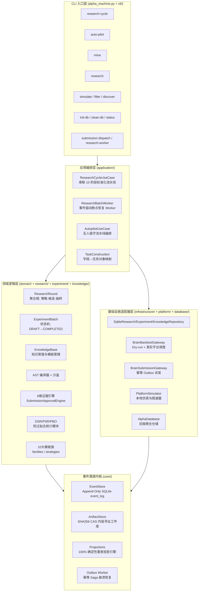

# Alpha Factory — 系统架构与设计文档 (System Architecture & Design)

> **版本**: v2.0 | **更新日期**: 2026-08-25

---

## 一、 系统定位与目标

**Alpha Factory**（`alpha_operator_framework`）是一个面向 **WorldQuant BRAIN** 平台的**工业级全生命周期量化 Alpha 因子研究与生产治理系统**。

### 1.1 核心设计目标

| 目标 | 实现手段 |
|:---|:---|
| **不可变审计溯源** | 事件溯源不可变事实内核（Event-Sourced Core），所有研究活动均以 Append-Only 事件流记录 |
| **统计严谨防过拟合** | 持久化 TrialLedger + DSR/PSR/PBO/CSCV 多重检验体系，抵御多重测试偏差 |
| **全自主进化** | 符号语法树自由杂交（SymbolicTreeBreeder）+ LLM 反思闭环 + 模板反向蒸馏 |
| **崩溃幂等恢复** | Outbox Saga 模式，Worker 重启自动从断点续传，绝不重复提交 |
| **证据边界安全** | 5 级证据等级枚举 + 6 维提交硬门禁，彻底杜绝样本内绩效直接提交 |

### 1.2 技术体系

```
事件溯源不可变事实内核 (Event-Sourced Core)
  ├── 领域驱动设计 (DDD) 四限界上下文
  ├── AST 规范编译器 + FASTEXPR 等价去重
  ├── 符号语法树自由杂交进化 (Symbolic Tree Breeder)
  ├── 大模型假说提取与反思闭环 (LLM Reflexion)
  ├── 6 维证据准入状态机
  ├── 动态 DSR/PSR/PBO 防过拟合引擎
  ├── Outbox Saga 异步平台网关
  └── 自进化知识库 (Template Library + Knowledge Base)
```

---

## 二、 整体架构分层模型

### 2.1 DDD 五层架构全景



### 2.2 包目录与职责边界

| 包路径 | 角色 | 核心文件 |
|:---|:---|:---|
| `alpha_operator_framework/core/` | 事件溯源底层内核 | `event_store.py`, `artifacts.py`, `projections.py`, `events.py` |
| `alpha_operator_framework/application/` | 用例编排层 | `research_cycle.py`, `research_worker.py`, `autopilot.py`, `task_construction.py` |
| `alpha_operator_framework/research/` | 探索轮次领域 | `round.py`, `policy.py`, `selection.py`, `pruning.py`, `pipeline.py`, `field_loader.py` |
| `alpha_operator_framework/experiment/` | 实验批次领域 | `models.py`, `lifecycle.py`, `evaluation.py`, `mutation.py` |
| `alpha_operator_framework/knowledge/` | 知识蒸馏领域 | `models.py`, `distillation.py`, `submission.py` |
| `alpha_operator_framework/domain/` | 纯函数量化逻辑 | `evidence.py`, `overfitting.py`, `families.py`, `fields.py`, `operators.py`, `ast/` |
| `alpha_operator_framework/infrastructure/` | 外部依赖适配器 | `sqlalchemy_repositories.py`, `sqlalchemy_migrations.py`, `runtime_factory.py`, `submission.py`, `telemetry.py` |
| `alpha_operator_framework/platform/` | 平台通信层 | `platform_simulator.py`, `alpha_source.py`, `local_fields.py`, `rate_limiter.py`, `task_scheduler.py` |
| `alpha_operator_framework/database/` | 旧版聚合数据库 | `schema.py`, `models.py`, `connection.py`, `config.py`, `cleaner.py`, `repository.py` |
| `alpha_operator_framework/generation/` | 表达式生成层 | `template_library.py`, `super_alpha.py`, `portfolio.py`, `hypothesis/` |
| `alpha_operator_framework/distill/` | 自进化信号蒸馏 | `field_signals.py`, `operator_signals.py`, `pair_signals.py`, `template_pruner.py`, `template_abstractor.py` |
| `alpha_operator_framework/cache/` | 平台元数据缓存 | `datafields.py`, `operators.py`, `universes.py` |
| `alpha_operator_framework/strategies/` | 生成策略 | `composite.py`, `multi_stage.py`, `multivariate.py`, `template.py` |
| `alpha_operator_framework/carpet/` | 地毯挖掘 | `miner.py`, `candidate_generation.py`, `sampling.py`, `simulation.py`, `optimization.py` |
| `alpha_operator_framework/cli/` | CLI 命令层 | `command_registry.py`, `router.py`, `research.py`, `analysis.py`, `simulation.py` |

---

## 三、 事件溯源内核设计 (`core/`)

### 3.1 事件类型体系（`events.py`）

6 大生命周期，共 20+ 个不可变事件类型：

| 分类 | 事件类型 |
|:---|:---|
| **策略与实验图** | `PolicyCreated`, `PartitionLocked`, `FieldSnapshotCaptured`, `HypothesisRegistered` |
| **候选生成与打分** | `CandidateGenerated`, `CandidateRejectedByRule`, `CandidateScored` |
| **平台仿真 Outbox** | `BatchAllocated`, `SimulationRequested`, `SimulationAccepted`, `SimulationPolled`, `SimulationCompleted` |
| **验证与相关性** | `ValidationComputed`, `CorrelationChecked` |
| **决策与审批** | `DecisionProposed`, `DecisionApproved`, `DecisionRejected` |
| **提交与监控** | `SubmissionRequested`, `SubmissionConfirmed`, `CandidateRetired` |

### 3.2 内容寻址工件库（`artifacts.py`）

- 大体积 JSON（回测结果、LLM 生成物）以 **SHA256 哈希为键**存入 `ArtifactStore`
- 事件日志仅记录轻量引用指针 `payload_ref: "art:sha256..."`，保持事件流轻量高效

### 3.3 Outbox Saga 崩溃恢复流程

```
SIMULATION_REQUESTED
  → SIMULATION_ACCEPTED（持久化 Location）
    → SIMULATION_POLLED
      → SIMULATION_COMPLETED（幂等键关闭）

崩溃断点：若进程在 ACCEPTED 后崩溃
Worker 重启 → 扫描 ACCEPTED 状态任务 → 从 Location 继续轮询 → 零重复提交
```

### 3.4 物化视图重放（`projections.py`）

从任意历史时间点的原始事件流，**100% 确定性重放**重建当前状态（因子池、候选集合、族群表现统计、实验图谱）。

---

## 四、 DDD 领域驱动设计四限界上下文

### 4.1 探索轮次领域（`research/`）

**核心聚合根**: `ResearchRound`

```
ResearchPolicy（策略配置）
  ├── 抽样算法：Stratified / D-Optimal / Thompson / UCB / Diversity
  ├── 字段画像：FieldSpec + min_coverage + min_date_coverage
  └── AstPrePruner：AST 结构规范预剪枝

ResearchRound
  ├── Candidate 集合（候选表达式 + 证据等级 + 谱系 DAG）
  ├── KnowledgeSnapshot（冻结的知识库快照）
  └── ResearchPolicy（不可变策略配置）
```

**文献提炼流水线**（`research/pipeline.py`）：

| 步骤 | 组件 | 功能 |
|:---:|:---|:---|
| 1 | `DocumentParser` | PDF/MD 学术文献解析 |
| 2 | `IdeaExtractor` | LLM 假说意图提取 |
| 3 | `FieldGrounder` | 字段动态语义对齐 |
| 4 | `AstTranslator` | 假说→合法 AST 表达式转译 |
| 5 | `LLMReflexionEngine` | 失败病因归因→二代变异 |

### 4.2 实验批次领域（`experiment/`）

**核心实体**: `ExperimentBatch` 状态机

$$\text{DRAFT} \xrightarrow{} \text{SUBMITTED} \xrightarrow{} \text{ACCEPTED} \xrightarrow{} \text{EVALUATED} \xrightarrow{} \text{MUTATED} \xrightarrow{} \text{COMPLETED}$$

任意阶段均可流转至 `FAILED`。

| 文件 | 职责 |
|:---|:---|
| `models.py` | `ExperimentBatch`, `BacktestTask`, `BacktestResult`, `EvaluationRecord` |
| `lifecycle.py` | `ExperimentBatchStateMachine` 显式有向状态机 |
| `evaluation.py` | 6 维证据核验 + Pareto 非支配排序 |
| `mutation.py` | `NSGA2Mutator` 优胜候选遗传变异提议 |

### 4.3 知识蒸馏领域（`knowledge/`）

```
优胜因子表达式
  → SignalDistiller：去标识化骨架抽象（{a},{b} 槽位）
  → template_library：持久化为 distilled 族模板
  → 下一轮 ResearchRound 直接消费（零样本迁移）
```

### 4.4 基础设施适配器层（`infrastructure/`）

| 适配器 | 接口 | 实现 |
|:---|:---|:---|
| `ResearchRepository` | 保存/查询 ResearchRound | `SqliteResearchRepository` |
| `ExperimentRepository` | 批次持久化 | `SqliteExperimentRepository` |
| `KnowledgeRepository` | 知识库快照持久化 | `SqliteKnowledgeRepository` |
| `BacktestGateway` | 提交/查询回测 | `BrainBacktestGateway`（支持 Dry-run） |
| `SubmissionGateway` | 正式提交 Alpha | `BrainSubmissionGateway`（幂等 Outbox） |
| `TelemetrySink` | 遥测指标收集 | `JsonLinesTelemetrySink` |

---

## 五、 证据边界与 6 维提交治理 (`domain/evidence.py`)

### 5.1 5 级证据可信度等级

```
SYNTHETIC (1)          → 语法合成测试
SANDBOX_DIAGNOSTIC (2) → 本地快速截面 IC 与单调性诊断
PLATFORM_IS (3)        → WorldQuant BRAIN 样本内真实回测
PLATFORM_OS (4)        → 平台锁死样本外 Locked-OOS 测试
SUBMISSION_READY (5)   → 唯一可提交的证据等级
```

> [!IMPORTANT]
> `is_eligible_for_submission` 属性**严格仅对** `SUBMISSION_READY` 返回 `True`，彻底杜绝 `platform_is` 绕过 OOS 门禁直接提交。

### 5.2 决策状态机（`DecisionState`）

```
DRAFT → SIMULATED → DIAGNOSED → CHECKS_VERIFIED → SUBMISSION_READY → SUBMITTED
  ↘        ↘           ↘              ↘                 ↘
                     REJECTED（任意阶段均可拒绝）
```

### 5.3 6 维提交硬门禁（`SubmissionApprovalEngine`）

候选 Alpha 必须**同时满足**全部 6 个维度：

| 维度 | 具体条件 |
|:---|:---|
| **1. Locked-OOS 证据** | 具备 `PLATFORM_OS` 且 $\text{Sharpe}_{\text{OOS}} \ge 1.25$ |
| **2. 18 项 Checks** | 全部 PASS（无 RA/PPA 失败项） |
| **3. 相关性门槛** | 自相关 $\text{SC} \le 0.70$，母本相关性 $\text{PC} \le 0.70$ |
| **4. 交易摩擦与容量** | 换手率 $\in [1\%, 70\%]$，Margin $\ge 4.0\text{bp}$ |
| **5. 谱系 DAG 完整性** | 具备父级变异与演进溯源图 |
| **6. 终审裁决** | AlphaJudge 评级为 `READY` |

---

## 六、 Alpha 生成体系

### 6.1 10 大表达式生成族群（`domain/families.py`）

| 族群 | 名称 | 描述 |
|:---:|:---|:---|
| 0 | `unary` | 单字段操作（10 个模板）：斜率、增长率、平方动量、衰减动量、排名反转等 |
| 1 | `binary` | 双字段回归/正交（8 个模板）：残差、回归 Beta、差分组合等 |
| 2 | `ternary` | 三字段联合/条件切换（7 个模板） |
| 3 | `quaternary` | 四元多阶 group 操作 |
| 4 | `distilled` | 自反向蒸馏生成的 `{a}/{b}` 槽位骨架 |
| 5 | `antonym` | 语义反义词对配对 |
| 6 | `semantic_pair` | 语义关联字段对 |
| 7 | `paired_base` | 已验证配对组合 |
| 8 | `cross_market` | 跨市场字段迁移 |
| 9 | `symbolic_bred` | AST 符号语法树自由杂交 |

### 6.2 符号语法树自由杂交（`domain/ast/`）

- **随机子树交换**：在语义一致的节点位置交换子树
- **三层尺度架构 (Three-Tier Scaling)**：快中慢三层时序窗口嵌套
- **行业-特质正交分解 (Sector-Idiosyncratic Decomposition)**：自动插入 `grouprank` 中性化

### 6.3 4 大纯抽样算法（`research/selection.py`）

| 算法 | 适用场景 | 原理 |
|:---|:---|:---|
| `Stratified` | 均衡覆盖 | 按模板族均匀分层抽样 |
| `D-Optimal` | 最大信息增益 | D-最优设计矩阵最大化特征空间覆盖 |
| `Thompson` | 贝叶斯自适应 | Thompson 采样多臂老虎机 |
| `UCB` | 探索-利用权衡 | Upper Confidence Bound 置信上界 |
| `Diversity` | 结构多样性 | 基于 AST 结构相似度去重抽样 |

---

## 七、 AST 规范编译器（`domain/ast/`）

### 7.1 编译流水线

```
原始表达式字符串
  → Parser（递归语法解析）
  → TypeChecker（数据类型与算子兼容性校验）
  → Canonicalizer（消除空格/括号/操作数顺序等表面差异）
  → FASTEXPR（生成全局唯一标准规范化字符串）
  → SHA256 哈希（全局唯一内容指纹）
```

### 7.2 废弃字段强制拦截

| 废弃字段 | 替代标准字段 |
|:---|:---|
| `close`, `open`, `high`, `low` | `returns`, `vwap` |
| 价格衍生字段 | `volume`, `market_cap`, `sharesout` |

---

## 八、 统计防过拟合防御体系（`domain/overfitting.py`）

### 8.1 持久化试验账本（`trial_ledger` 表）

所有生成、变异、规则剪枝与回测试验均持久化，**跨进程跨批次累计**，不因重启归零。

### 8.2 结构族内相关性折损（Effective Trials Neff）

$$N_{\text{eff}} = 1 + (N - 1)(1 - \bar{\rho}_{\text{family}})$$

（默认族内相关性 $\bar{\rho} \approx 0.35$）

### 8.3 防过拟合指标矩阵

| 指标 | 说明 |
|:---|:---|
| **DSR** | Deflated Sharpe Ratio，极值理论多重检验校正 |
| **PSR** | Probabilistic Sharpe Ratio，超越基准的统计显著性概率 |
| **Haircut Sharpe** | Harvey & Liu 多重测试惩罚折损夏普 |
| **PBO/CSCV** | 组合对称交叉验证过拟合概率 |

---

## 九、 多轮研究闭环（`loop.py`）

### 9.1 六阶段闭环架构

```
字段选择 → 表达式合成 → 批量回测 → 信号优化 → 提交 → 沉淀与抽象
    ↑_______________________________________________|
                     五根回流管道
```

### 9.2 五根回流管道

| 管道 | 方向 | 功能 |
|:---|:---|:---|
| 字段信号回流 | 阶段 6 → 阶段 1 | 按字段聚合命中率，加权采样下一轮字段 |
| 模板抽象回流 | 阶段 6 → 阶段 2 | 优胜因子蒸馏为 `{a},{b}` 骨架，回填 template_library |
| 配对信号回流 | 阶段 6 → 阶段 2 | 有效配对组合持久化，下一轮优先复用 |
| 算子信号回流 | 阶段 6 → 阶段 2 | 有效算子命中率，证据驱动挑选算子 |
| 淘汰规则自生长 | 阶段 6 → 阶段 2 | 零信号模板模式 → 负向剪枝规则库（负向蒸馏） |

---

## 十、 超级因子生成（Super Alpha 2.0）

位于 `generation/super_alpha.py` 和 `domain/orthogonalization.py`：

### 10.1 生成流程

```
1. 筛选优质 Alpha 池（Sharpe/Fitness/Turnover/Margin 多维过滤）
   ↓
2. Gram-Schmidt 正交残差化（消除多重共线性）
   ↓
3. HRP 分层风险平价配置（Hierarchical Risk Parity）
   ↓
4. 输出超级合成因子（高 Sharpe + 超低回撤）
```

### 10.2 算法原理

**Gram-Schmidt 正交化**：

$$\vec{e}_k = \text{residual}\!\left(\vec{\alpha}_k,\; \text{span}(\vec{e}_1, \dots, \vec{e}_{k-1})\right)$$

**HRP 分配**（在层次聚类树状图每个叶节点递归分配）：

$$w_i \propto \frac{1}{\sigma_{c_i}^2}$$

---

## 十一、 数据库架构（17 张核心表）

> 详细表结构与 SQL 速查见 [DATABASE_DESIGN.md](DATABASE_DESIGN.md)

### 11.1 数据库定位

- **路径**: `data/alpha_research.db`（Zero-Commit，不提交 Git）
- **引擎**: SQLite 3.37+ + WAL 模式
- **配置中心**: `database/config.py`，支持 `ALPHA_DATABASE_PATH` / `ALPHA_DATABASE_URL` 环境变量覆盖

### 11.2 表分组

| 分组 | 表 | 职责 |
|:---|:---|:---|
| **A. 表达式与回测** | `alpha_expressions`, `alpha_details`, `alpha_checks`, `backtest_dataset_records` | 候选表达式去重、平台回测指标、Checks 审计 |
| **B. 批次调度** | `simulation_batches`, `simulation_results`, `super_alpha_candidates`, `alpha_optimization_queue`, `alpha_submission_candidates` | 批次状态、子任务明细、超级因子、提交候选 |
| **C. 自进化知识库** | `template_library`, `template_prune_rules`, `field_signal_stats`, `pair_signal_stats`, `operator_signal_stats` | 母版骨架库、剪枝规则、字段/配对/算子信号统计 |
| **D. 事件溯源与审计** | `event_log`, `trial_ledger`, `schema_version` | 不可变事实流、防过拟合试验账本、版本管理 |

### 11.3 并发控制

```sql
PRAGMA journal_mode = WAL;       -- 读写互不阻塞
PRAGMA synchronous = NORMAL;     -- 降低磁盘 I/O 延迟
PRAGMA busy_timeout = 30000;     -- 30s 锁等待重试（消除 database is locked）
```

---

## 十二、 CLI 命令架构（`cli/`）

### 12.1 命令注册与路由

- **注册**: `cli/command_registry.py` `command_specs()` 声明式定义所有 22 个命令
- **入口**: `alpha_machine.py::main()` → `cli/router.py::route()`
- **懒加载**: `LazyCommandHandler` 仅在命令分发时动态 import，零启动开销

### 12.2 命令按域分类

| 域 | 命令 |
|:---|:---|
| `research` | `research-cycle`, `auto-pilot`, `mine`, `research`, `research-worker`, `research-rebuild` |
| `submission` | `submission-dispatch` |
| `fields` | `discover`, `prepare`, `filter`, `second-order` |
| `simulation` | `simulate`, `poll-simulation` |
| `super_alpha` | `prepare-super`, `simulate-super`, `poll-super` |
| `operations` | `init-db`, `clean-db`, `storage-backup`, `storage-restore`, `drill-recovery`, `status` |

### 12.3 Dry-run 安全设计

所有消耗平台配额的命令均**默认 Dry-run**，`--execute` 标志才授权真实回测：

```bash
# 默认安全 Dry-run（本地生成计划，不调用平台）
python alpha_machine.py research-cycle --region GBR --universe TOP700 --algorithm d_optimal

# 显式授权真实回测（消耗配额）
python alpha_machine.py research-cycle --region GBR --universe TOP700 --algorithm d_optimal --execute
```

---

## 十三、 生产部署

### 13.1 无人值守脚本

```bash
# Linux/macOS
bash run_autopilot.sh GBR TOP700 analyst7 4 5

# Windows PowerShell
.\run_autopilot.ps1 -Region GBR -Universe TOP700 -Datasets "analyst7" -SamplePerFamily 4 -BatchSize 5
```

### 13.2 Systemd 守护进程（`scripts/alpha-factory.service`）

```ini
[Service]
ExecStart=/usr/bin/python3 alpha_machine.py auto-pilot --region GBR --universe TOP700 --execute
Restart=always
RestartSec=30
```

### 13.3 数据库备份

```bash
python alpha_machine.py storage-backup --destination backups/alpha_$(date +%Y%m%d).db
python alpha_machine.py storage-restore --backup backups/alpha_20260825.db
```

---

## 十四、 关键代码速查

| 功能 | 文件路径 |
|:---|:---|
| 事件类型枚举 | [`core/events.py`](alpha_operator_framework/core/events.py) |
| 证据等级状态机 | [`domain/evidence.py`](alpha_operator_framework/domain/evidence.py) |
| DSR/PSR/PBO 防过拟合 | [`domain/overfitting.py`](alpha_operator_framework/domain/overfitting.py) |
| 10 大模板族 | [`domain/families.py`](alpha_operator_framework/domain/families.py) |
| 4 大抽样算法 | [`research/selection.py`](alpha_operator_framework/research/selection.py) |
| 研究用例编排 | [`application/research_cycle.py`](alpha_operator_framework/application/research_cycle.py) |
| 批次 Worker | [`application/research_worker.py`](alpha_operator_framework/application/research_worker.py) |
| 数据库 Schema | [`database/schema.py`](alpha_operator_framework/database/schema.py) |
| CLI 命令注册 | [`cli/command_registry.py`](alpha_operator_framework/cli/command_registry.py) |
| 多轮研究闭环 | [`loop.py`](alpha_operator_framework/loop.py) |
| 超级因子生成 | [`generation/super_alpha.py`](alpha_operator_framework/generation/super_alpha.py) |
| 文献提炼流水线 | [`research/pipeline.py`](alpha_operator_framework/research/pipeline.py) |
| LLM 反思引擎 | [`research/reflexion_engine.py`](alpha_operator_framework/research/reflexion_engine.py) |
| 主 CLI 入口 | [`alpha_machine.py`](alpha_machine.py) |
