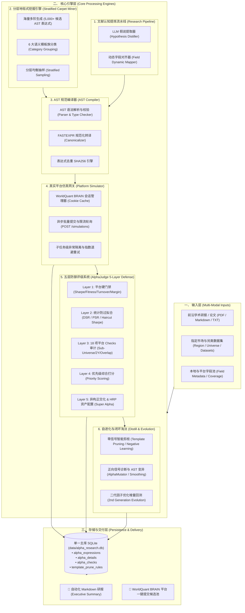
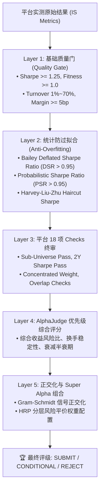
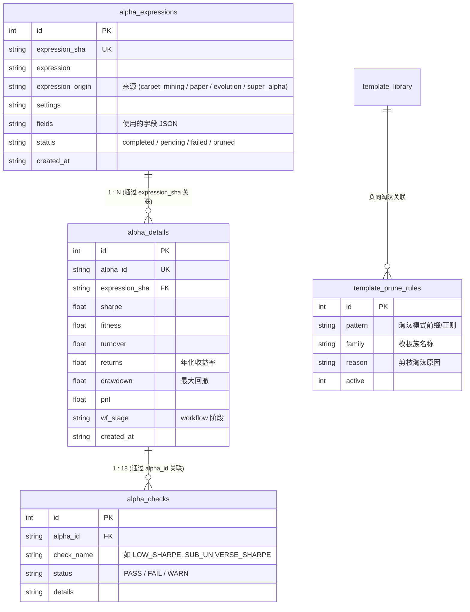
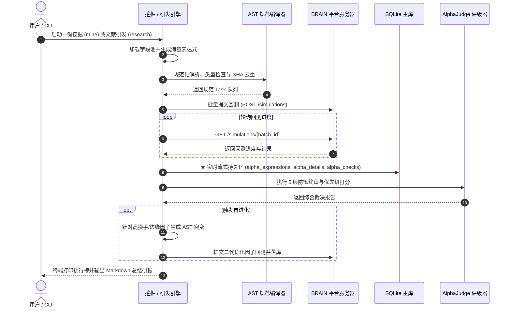

# Alpha Factor Operator Framework 架构与技术全景设计文档

本文档详细阐述 **Alpha Factor Operator Framework** 的系统架构、设计哲学、分层模型、数据流转机制与关键算法实现。

---

## 一、 系统架构总览 (System Architecture Overview)

框架采用**领域驱动设计 (Domain-Driven Design, DDD)**，解耦量化因果逻辑、AST语法编译、多阶算子组合、真实平台回测网关与五层防御评级体系。

---

## 二、 核心分层与模块详解

### 1. AST 抽象语法树与规范编译器 (`domain/ast/`)

#### 核心职责
- 解析原始字符串表达式为强类型 AST 节点树；
- 校验操作符语法、嵌套层级深度、中性化结构合法性；
- 消除表达式表面差异（如空格、括号、操作数顺序），生成全局唯一标准规范化字符串（Canonical String）与 SHA256 指纹；
- 从 AST 中自动提取所引用的原子字段列表（`extract_ast_fields`）和首层操作符（`extract_first_operator`）。

#### 关键实现：
- `parse_expression(code: str) -> ASTNode`：将表达式递归解析为树形结构。
- `to_canonical_string(node: ASTNode) -> str`：转译为规范 FASTEXPR 格式。
- `compute_expression_sha(code: str) -> str`：生成精准的哈希去重签名。

---

### 2. 算子库与多阶模板组合体系 (`domain/operators/` & `domain/families.py`)

#### 核心职责
- 维护涵盖 **时序算子 (ts_ops)**、**截面算子 (cs_ops)**、**分组算子 (group_ops)**、**算术与非线性算子 (math_ops)** 的标准算子全集；
- 提供 **86 个正交结构模板族**（涵盖一元时序、二元配对、三元差分比率、四元细分行业中性化）；
- 支持原子字段的安全包装（如针对稀疏矩阵的 `winsorize(ts_backfill(x, 120), std=4.0)` 与事件向量的 `vec_avg` / `vec_stddev` 提取）。

---

### 3. 分层地毯式挖掘引擎 (`carpet_mining.py`)

针对全市场或特定另类数据集进行无死角覆盖与自进化，包含六大阶段：
1. **海量生成**：0.1 秒内从目标数据集中生成 5,000+ 条多阶候选 AST 表达式；
2. **分类分层抽样 (Stratified Sampling)**：按 6 大语义模板族分类（`ts_momentum`, `mean_reversion`, `macd_velocity`, `relative_ratio`, `asymmetric_risk`, `cross_interaction`），每类随机抽选固定数量（如 4 条）代表因子，杜绝模式单一化；
3. **分批回测与流式落库**：按安全并发批次提交回测，每批跑完立刻落库；
4. **零信号智能剪枝**：评估模板族胜率密度，零信号模板写入 `template_prune_rules` 永久剪枝；
5. **正向信号自进化**：对具备潜力的因子自动触发 AST 变异（降换手/调衰减/反义反转），提交二代优化回测并落库。

---

### 4. 前沿学术研报端到端研发流水线 (`research/`)

直接将学术论文（PDF / Markdown）转化为在线实测 Alpha：
- **`HypothesisDistiller`**：利用大模型或规则引擎提炼文献因果逻辑与经济学假设；
- **`DynamicFieldLoader`**：根据目标区域（如 GBR TOP700），自动检索匹配最佳真实数据集（如 `model30`, `risk71`, `insider_agg_matrix`）；
- **`FormulaCompiler`**：将文字假设无缝编译为 BRAIN FASTEXPR AST；
- **`AutonomousPipeline`**：自动提交在线回测、执行 AlphaJudge 终审并输出研报。

---

### 5. 真实平台仿真网关 (`platform/platform_simulator.py`)

#### 核心职责
- 封装 WorldQuant BRAIN 官方 REST API；
- 实现会话持久化与 Cookie 免密重连；
- 具备指数退避重试（Backoff Retry）与 90s 超时保护，确保网络代理抖动时不中断批次；
- 隔离单个语法错误的 Alpha 任务，保证批次中其他正常任务顺利完成。

---

### 6. 五层防御评级系统 (`domain/judge/evaluator.py`)

---

### 7. 统一主数据库存储设计 (`database/`)

所有研究流水线、地毯式挖掘、回测指标与 Checks 结果统一沉淀至单一大主库 [`data/alpha_research.db`](file:///d:/quant/alpha_factory/data/alpha_research.db)。

#### 核心表结构映射关系：

#### Windows 并发与性能保障：
- 启用 `PRAGMA journal_mode = WAL` 与 `PRAGMA synchronous = NORMAL`；
- 连接级 `busy_timeout = 30000`（30秒等待锁释放）；
- 初始化 DDL 幂等守卫，避免重复执行 `CREATE TABLE` 产生表级死锁。

---

## 三、 系统执行时序与数据流转

---

## 四、 总结与扩展指南

Alpha Factor Operator Framework 实现了从理论假设到工业级落地的完整飞轮：
1. **零硬编码**：字段动态提取与自适应中性化；
2. **极速生成**：0.1 秒内生成数千条多阶 AST 表达式；
3. **安全并发**：单批流式落库保护，防网络中断与额度浪费；
4. **严苛防过拟合**：DSR/PSR 与 18 项平台 Checks 双重把关；
5. **闭环自进化**：坏模板智能剪枝 + 优胜因子针对性基因突变。
