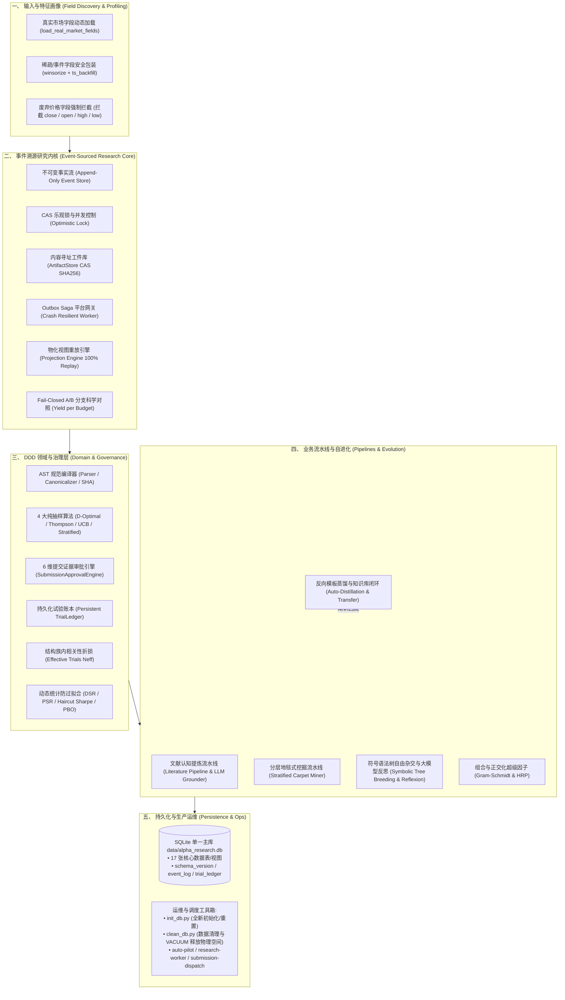

# Alpha Factory 架构与技术全景设计文档 (System Architecture)

本文档系统性阐述 **Alpha Factory** 的整体架构、设计哲学、领域驱动设计 (DDD) 分层模型、事件溯源内核、6 维证据边界、统计防过拟合体系与自进化知识库。

---

## 一、 系统架构总览 (System Architecture Overview)

框架采用**领域驱动设计 (Domain-Driven Design, DDD)** 结合 **事件溯源不可变事实内核 (Event Sourced Research Core)** 架构模式，彻底解耦量化因果逻辑、AST 语法编译、多阶算子组合、真实平台回测调度与提交治理体系。



---

## 二、 事件溯源研究内核 (Event-Sourced Research Core)

位于 `alpha_operator_framework/core/`，是整个研究平台的**唯一事实来源 (Single Source of Truth)**：

### 1. 不可变事件事实 (`events.py`)
- 所有研究活动均表示为不可篡改的事件实体 `Event(event_id, stream_id, event_type, payload, payload_ref, actor, created_at)`。
- 事件类型覆盖 6 大生命周期：
  - **策略与实验图**：`PolicyCreated`, `PartitionLocked`, `FieldSnapshotCaptured`, `HypothesisRegistered`
  - **候选生成与打分**：`CandidateGenerated`, `CandidateRejectedByRule`, `CandidateScored`
  - **平台仿真 Outbox**：`BatchAllocated`, `SimulationRequested`, `SimulationAccepted`, `SimulationPolled`, `SimulationCompleted`
  - **验证与相关性**：`ValidationComputed`, `CorrelationChecked`
  - **决策与审批**：`DecisionProposed`, `DecisionApproved`, `DecisionRejected`
  - **提交与监控**：`SubmissionRequested`, `SubmissionConfirmed`, `CandidateRetired`

### 2. 内容寻址工件库 (`artifacts.py`)
- 大体积回测 JSON、LLM 生成元数据、策略配置等全部通过 SHA256 哈希作为键存入 `ArtifactStore`；
- 事件日志中仅记录工件引用指针 `payload_ref: "art:sha256..."`，确保事件流轻量高效。

### 3. 追加写入事件存储 (`event_store.py`)
- 基于 SQLite `event_log` 表的只追加存储，支持流读取、全局读取与快照版本控制。

### 4. 平台 Outbox 异步 Worker (`outbox_worker.py`)
- 采用 **Outbox + 幂等键 Saga 模式** 与平台交互；
- **崩溃断点恢复**：`SIMULATION_ACCEPTED` 保持幂等键处于进行中并持久化 Location，Worker 重启自动从挂起任务断点续传；仅终态（`COMPLETED` / `FAILED`）关闭幂等键；
- **Mock 净化**：内置 Mock 强制仅产出 `synthetic` 等级；升级 `platform_is` 必须严格核验真实平台 `alpha_id`。

### 5. 物化视图重放与投影 (`projections.py`)
- 具备 **100% 确定性重放一致性**：从任意时间点的原始事件流重放，即可完整重建当前因子池、候选状态、因子族表现统计与实验图谱。

### 6. Fail-Closed A/B 科学对照引擎 (`engine.py`)
- 严格校验两分支的基础配置：若 `discovery_is` / `validation` / `locked_oos` 锁死时间分区、市场区域或股票宇宙不一致，直接拦截并拒绝比较；
- 主指标采用 **单位预算合格 Locked-OOS 因子产出率 (`yield_per_budget`)** 与 **因子族多样性**，彻底消除基于 IS 夏普判胜导致的过拟合伪胜出。

---

## 三、 DDD 领域驱动设计分层架构

框架按 DDD 限界上下文组织为以下清晰的分层架构：

### 1. 应用编排层 (`alpha_operator_framework/application/`)
- `ports.py`: 定义领域外部端口规范；
- `research_cycle.py`: `ResearchCycleUseCase`，串联 10 阶段标准投研生命周期；
- `research_runtime.py`: 运行时上下文与调度环境；
- `research_worker.py`: 异步事件驱动 Worker，负责断点恢复与未完成批次轮询。

### 2. 探索轮次与候选构造领域 (`alpha_operator_framework/research/`)
- `round.py`: `ResearchRound` 聚合根；
- `policy.py`: `ResearchPolicy` 策略配置与抽样算法工厂；
- `selection.py`: **4 大纯抽样算法**（`Stratified`、`D-Optimal`、`Thompson`、`UCB`、`Diversity`）；
- `pruning.py`: `AstPrePruner` 语法规范预剪枝；
- `construction.py`: `AstCandidateBuilder` 候选表达式生成；
- `field_loader.py`: 真实市场字段动态加载与画像；
- `pipeline.py`: 文献认知提炼端到端流水线。

### 3. 实验批次与评估治理领域 (`alpha_operator_framework/experiment/`)
- `models.py`: `ExperimentBatch`, `BacktestTask`, `BacktestResult`, `EvaluationRecord`；
- `lifecycle.py`: `ExperimentBatchStateMachine` (DRAFT $\to$ SUBMITTED $\to$ ACCEPTED $\to$ EVALUATED $\to$ MUTATED $\to$ COMPLETED)；
- `evaluation.py`: 6 维证据硬门禁核验与 Pareto 非支配排序；
- `mutation.py`: `NSGA2Mutator` 优胜候选遗传变异提议生成。

### 4. 知识蒸馏与准入领域 (`alpha_operator_framework/knowledge/`)
- `models.py`: `KnowledgeBase`, `KnowledgeSnapshot`, `PruneRuleEvidence`；
- `distillation.py`: `SignalDistiller`，负责将胜出因子反向蒸馏为去标识化母版骨架（`{a}`, `{b}`）；
- `submission.py`: `SubmissionApprovalService`，Fail-Closed 提交准入审计。

### 5. 基础设施适配器层 (`alpha_operator_framework/infrastructure/`)
- `sqlite.py`: `SqliteResearchRepository`, `SqliteExperimentRepository`, `SqliteKnowledgeRepository`；
- `brain.py`: `BrainBacktestGateway`（带 Dry-run 防护与真实平台调度）；
- `submission.py`: `SubmissionOutboxWorker` 与 `BrainSubmissionGateway`；
- `telemetry.py`: `JsonLinesTelemetrySink` 遥测指标收集。

---

## 四、 证据边界与 6 维提交治理体系

位于 `alpha_operator_framework/domain/evidence.py` 与 `knowledge/submission.py`：

### 1. 严格的证据可信度等级 (`EvidenceLevel`)
```
1. SYNTHETIC (语法/合成测试)
      ↓
2. SANDBOX_DIAGNOSTIC (本地快速截面 IC 与单调性诊断)
      ↓
3. PLATFORM_IS (WorldQuant BRAIN 官方服务器样本内真实回测)
      ↓
4. PLATFORM_OS (平台锁死样本外 Locked-OOS 测试)
      ↓
5. SUBMISSION_READY (通过 6 维证据终审的正式提交候选)
```
- **提交资格红线**：`EvidenceLevel.is_eligible_for_submission` 仅对 `SUBMISSION_READY` 开放，彻底杜绝 `platform_is` 绕过 OOS 门禁直接提交。

### 2. 显式有向状态机 (`DecisionState`)
严格执行单向拓扑流转，禁止跨阶段越级：
$$\text{DRAFT} \longrightarrow \text{SIMULATED} \longrightarrow \text{DIAGNOSED} \longrightarrow \text{CHECKS\_VERIFIED} \longrightarrow \text{SUBMISSION\_READY} \longrightarrow \text{SUBMITTED}$$
任何阶段均可因不达标流转至 $\text{REJECTED}$。

### 3. 6 维提交证据审批引擎 (`SubmissionApprovalEngine`)
候选因子要提升至 `SUBMISSION_READY`，必须同时通过 6 大维度的严格核验：
1. **Locked-OOS 证据**：具备 `PLATFORM_OS` 或通过锁死 OOS 样本检验（$\text{Sharpe}_{\text{OOS}} \ge 1.25$）；
2. **18 项 Checks 全部 PASS**；
3. **相关性门槛**：自相关 $\text{SC} \le 0.70$，母本相关性 $\text{PC} \le 0.70$；
4. **交易摩擦与容量**：换手率 $\in [1\%, 70\%]$，Margin $\ge 4.0\text{bp}$；
5. **谱系 DAG 完整性**：具备完整的父级变异与演进溯源图；
6. **终审裁决**：AlphaJudge / 专家评级为 `READY`。

---

## 五、 统计防过拟合防御体系 (Anti-Overfitting Defense)

位于 `alpha_operator_framework/domain/overfitting.py`：

### 1. 持久化试验账本 (`TrialLedger`)
- 自动持久化至 SQLite `trial_ledger` 表，记录全生命周期所有生成、变异、规则剪枝与回测试验，支持跨进程与跨分支累计。

### 2. 结构族内相关性折损
根据同模板族内的结构同质性，计算真实有效试验次数：
$$N_{eff} = 1 + (N - 1)(1 - \bar{\rho}_{family})$$
（默认族内相关性 $\bar{\rho} \approx 0.35$）。

### 3. 纯 Python / NumPy 原生统计指标
- **Deflated Sharpe Ratio (DSR)**：基于极值理论校正多重测试偏差与非正态偏度/峰度；
- **Probabilistic Sharpe Ratio (PSR)**：超越基准夏普的统计显著性概率；
- **Haircut Sharpe Ratio**：Harvey & Liu 多重测试惩罚折损夏普；
- **CPCV / PBO**：组合对称交叉验证计算过拟合概率。

---

## 六、 AST 规范编译器与字段合规

位于 `alpha_operator_framework/domain/ast/`：
- **AST 语法解析与校验**：递归构建语法树，校验数据类型与算子兼容性；
- **FASTEXPR 规范化转译**：消除空格、括号、操作数顺序等表面差异，生成全局唯一标准规范化字符串与 SHA256 哈希；
- **废弃字段全面拦截**：在 AST 编译与字段摄取阶段**全面拦截 `close`、`open`、`high`、`low`**，强制采用 `returns`、`vwap`、`volume`、`market_cap`、`sharesout` 等标准字段。

---

## 七、 符号语法树自由杂交与自进化闭环

位于 `alpha_operator_framework/domain/ast/breeder.py` 与 `distill/`：
1. **递归 AST 符号杂交 (`SymbolicTreeBreeder`)**：无需人工模板，基于算子文法规则自由递归生成 1~4 层深度树，重点生成 **三层尺度架构 (Three-Tier Scaling)** 与 **行业-特质正交分解 (Sector-Idiosyncratic Decomposition)**；
2. **反向模板蒸馏 (`TemplateAbstractor`)**：优胜因子自动提炼为通用槽位 `{a}`, `{b}` 模板并沉淀入 `template_library`，支持新数据集零样本迁移；
3. **大模型假说与反思闭环 (`LLMReflexionEngine`)**：失败因子自动归因诊断并反馈给 LLM 生成二代变异公式；
4. **2D 跨字段共识后剪枝 (`template_prune_rules`)**：多字段连续失败的模板模式自动降权淘汰。

---

## 八、 投资组合与超级因子生成 (Super Alpha 2.0)

位于 `alpha_operator_framework/generation/super_alpha.py` 与 `domain/orthogonalization.py`：
1. **Gram-Schmidt 正交残差化**：将待组合因子依次投影到已有成熟因子的正交补空间上，彻底消除多重共线性；
2. **HRP 分层风险平价配置**：基于层次聚类树状图进行拟准对角化和方差倒数递归分配，输出兼具高夏普与超低回撤的超级合成因子。
