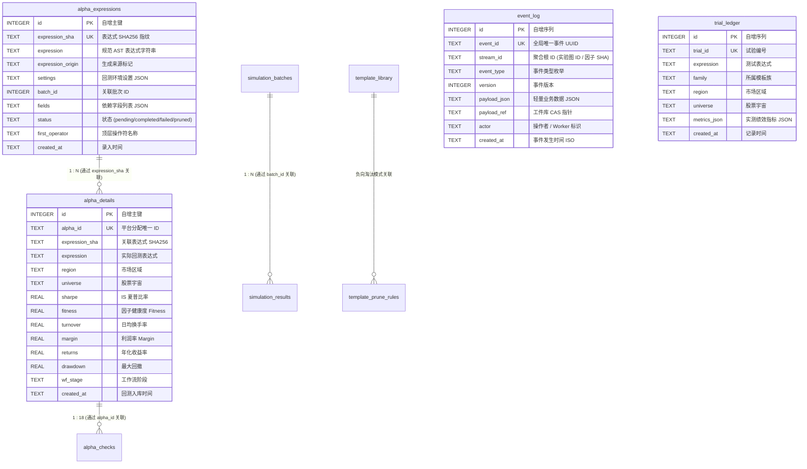

# Alpha 研究主数据库架构与设计规范 (Database Design Document)

本文档定义 **Alpha Factor Operator Framework** 主数据库 [`data/alpha_research.db`](file:///d:/quant/alpha_factory/data/alpha_research.db) 的全量 17 张核心表/视图结构、索引规划、关联模型、并发调优与运维指南。

---

## 一、 数据库定位与并发控制

### 1.1 存储引擎与架构定位
- **SQLite 3.37+**：以单文件形式存储在 `data/alpha_research.db`，轻量、零维护、便携且具备强 ACID 事务保障。
- **单一事实来源 (Single Source of Truth)**：承载全生命周期的 AST 表达式基因、平台回测绩效、18 项 Checks 审计、事件溯源流、试验账本与自进化规则。

### 1.2 高性能与 Windows 并发保障机制
针对 Windows 环境下多进程/多线程写入与锁争用，系统底层连接管理器内置如下优化：
1. **WAL 模式 (`PRAGMA journal_mode = WAL`)**：读写互不阻塞，读操作不持有排它锁；
2. **安全同步 (`PRAGMA synchronous = NORMAL`)**：大幅降低磁盘 I/O 延迟同时保证断电数据一致性；
3. **繁忙等待重试 (`PRAGMA busy_timeout = 30000`)**：设置 30 秒锁等待重试，消除 `sqlite3.OperationalError: database is locked`；
4. **幂等 DDL 守卫**：启动时检测关键表是否存在，若已初始化则直接跳过 `CREATE TABLE` / `ALTER TABLE`，杜绝重复 DDL 锁表。

### 1.3 数据库代码库零提交策略 (Zero-Commit Policy)
- **Git 忽略规范**：二进制数据库文件（`*.db`, `*.db-wal`, `*.db-shm`, `data/*.db`）严格加入 `.gitignore`，严禁提交至 Git 仓库，保证代码库纯净轻量；
- **一键初始化与校验工具**：
  ```bash
  python init_db.py           # 默认在本地初始化或增量更新 data/alpha_research.db
  python init_db.py --verify  # 校验当前数据库完整性与已应用的 Schema 版本
  python init_db.py --reset   # 清空并全新初始化数据库 (重新填充 30+ 模板种子)
  # 或通过统一 CLI:
  python alpha_machine.py init-db --verify
  ```

### 1.4 数据库智能清理与物理空间彻底释放 (VACUUM)
系统提供细粒度清理工具，支持淘汰项清除、全量重置与 SQLite 空间物理回收：
- **常用清理指令**：
  ```bash
  python clean_db.py                  # 清理失败/异常任务并执行 VACUUM 释放空间 (默认)
  python clean_db.py --mode stale     # 清理失败项、被剪枝项与孤儿数据
  python clean_db.py --mode all_data  # 清空所有历史回测数据 (保留表结构与模板库)
  python clean_db.py --dry-run        # 仅预览预计清理条目数，不实际删除
  # 或通过统一 CLI:
  python alpha_machine.py clean-db --mode stale
  ```

---

## 二、 实体关系图 (Entity Relationship Diagram)



---

## 三、 全量 17 张核心数据表/视图清单

| 序号 | 表 / 视图名 | 核心定位 | 核心索引 |
| :---: | :--- | :--- | :--- |
| 1 | **`alpha_expressions`** | 规范化表达式主索引与去重指纹池 | `idx_expr_sha`, `idx_expr_status`, `idx_expr_batch` |
| 2 | **`alpha_details`** | 真实平台回测绩效明细库 (IS Sharpe/Fitness/Turnover/Margin/Returns/Drawdown) | `idx_detail_sha`, `idx_detail_sharpe`, `idx_detail_fitness`, `idx_detail_wf_stage` |
| 3 | **`alpha_checks`** | 平台 18 项 Checks 终审审计结果子表 (1:18 关联) | `idx_checks_alpha`, `idx_checks_name` |
| 4 | **`template_library`** | 4 族 86 类基础表达式母版库 (含 30+ 预置种子) | `idx_tpl_family`, `idx_tpl_active` |
| 5 | **`template_prune_rules`**| 负向淘汰规则与模式过滤库 (Negative Learning) | `UNIQUE(pattern, pattern_type)` |
| 6 | **`event_log`** | 事件溯源内核不可变事实流表 (Append-Only) | `UNIQUE(event_id)`, `idx_event_stream` |
| 7 | **`trial_ledger`** | 持久化试验账本与搜索空间自由度累加表 (DSR 输入) | `UNIQUE(trial_id)`, `idx_trial_family` |
| 8 | **`simulation_batches`** | 异步并发回测批次生命周期与进度追踪表 | `idx_sim_batch_status`, `platform_batch_id` |
| 9 | **`simulation_results`** | 单个表达式回测结果与任务映射关系表 | `idx_sim_result_batch`, `idx_sim_result_alpha` |
| 10 | **`alpha_submission_candidates`** | 经过 6 维证据终审达标的正式提交候选池 | `idx_sub_cand_alpha`, `idx_sub_cand_sharpe`, `idx_sub_cand_submitted` |
| 11 | **`alpha_optimization_queue`** | 待修复/自进化突变优化队列 | `idx_opt_queue_alpha`, `idx_opt_queue_status`, `idx_opt_queue_priority` |
| 12 | **`super_alpha_candidates`** | Gram-Schmidt 正交化 / HRP 超级因子合成池 | `idx_super_candidate_status` |
| 13 | **`field_signal_stats`** | 字段级历史信号击中率与夏普表现画像表 | `idx_field_signal_hit`, `idx_field_signal_field` |
| 14 | **`pair_signal_stats`** | 跨字段语义二元配对交互表现统计表 | `idx_pair_signal_hit`, `idx_pair_signal_spec` |
| 15 | **`operator_signal_stats`** | 算子级历史胜率与表现沉淀表 | `UNIQUE(operator, region, universe, delay, round)` |
| 16 | **`datafields`** | 平台全量可用数据字段元数据与覆盖率缓存表 | `idx_datafields_region`, `idx_datafields_dataset`, `idx_datafields_type` |
| 17 | **`backtest_dataset_records`** | 数据集已回测防重记录表 | `UNIQUE(region, universe, delay, dataset_id, strategy)` |
| 18 | **`schema_version`** | 数据库 Schema 迁移版本追踪表 (`010_event_core`) | `PRIMARY KEY(version)` |

---

## 四、 核心数据表详细字段字典

### 1. `event_log` (事件溯源事实流)
```sql
CREATE TABLE IF NOT EXISTS event_log (
    id INTEGER PRIMARY KEY AUTOINCREMENT,
    event_id TEXT NOT NULL UNIQUE,
    stream_id TEXT NOT NULL,
    event_type TEXT NOT NULL,
    version INTEGER NOT NULL DEFAULT 1,
    payload_json TEXT NOT NULL DEFAULT '{}',
    payload_ref TEXT,
    actor TEXT NOT NULL DEFAULT 'system',
    created_at TEXT NOT NULL
);
```

### 2. `trial_ledger` (持久化试验账本)
```sql
CREATE TABLE IF NOT EXISTS trial_ledger (
    id INTEGER PRIMARY KEY AUTOINCREMENT,
    trial_id TEXT NOT NULL UNIQUE,
    expression TEXT NOT NULL,
    family TEXT NOT NULL DEFAULT 'default',
    region TEXT NOT NULL DEFAULT 'GBR',
    universe TEXT NOT NULL DEFAULT 'TOP700',
    metrics_json TEXT NOT NULL DEFAULT '{}',
    created_at TEXT NOT NULL
);
```

### 3. `alpha_details` (平台实测明细)
```sql
CREATE TABLE IF NOT EXISTS alpha_details (
    id INTEGER PRIMARY KEY AUTOINCREMENT,
    alpha_id TEXT NOT NULL UNIQUE,
    expression_sha TEXT NOT NULL,
    alpha_sha TEXT NOT NULL DEFAULT '',
    expression TEXT NOT NULL,
    region TEXT,
    universe TEXT,
    delay INTEGER DEFAULT 1,
    decay REAL DEFAULT 0,
    neutralization TEXT,
    truncation REAL DEFAULT 0,
    sharpe REAL DEFAULT 0,
    fitness REAL DEFAULT 0,
    turnover REAL DEFAULT 0,
    margin REAL DEFAULT 0,
    pnl REAL DEFAULT 0,
    returns REAL DEFAULT 0,
    drawdown REAL DEFAULT 0,
    long_count INTEGER DEFAULT 0,
    short_count INTEGER DEFAULT 0,
    grade TEXT,
    stage_platform TEXT,
    status_platform TEXT,
    wf_stage TEXT NOT NULL DEFAULT 'pending_validation',
    sc_result TEXT,
    sc_value REAL,
    pc_result TEXT,
    pc_value REAL,
    checks_json TEXT,
    ra_failed INTEGER NOT NULL DEFAULT 0,
    ppa_failed INTEGER NOT NULL DEFAULT 0,
    created_at TEXT NOT NULL,
    updated_at TEXT NOT NULL
);
```

---

## 五、 SQL 常用投研分析查询范例

### 1. 查询通过 6 维证据审批的 SUBMISSION_READY 候选
```sql
SELECT 
    d.alpha_id,
    d.expression,
    d.sharpe,
    d.fitness,
    d.turnover,
    d.margin,
    d.sc_value,
    d.pc_value,
    d.created_at
FROM alpha_details d
WHERE d.wf_stage = 'submission_ready'
ORDER BY d.sharpe DESC;
```

### 2. 查询各模板族的有效试验数与平均夏普
```sql
SELECT 
    t.family,
    COUNT(t.id) AS total_trials,
    AVG(CAST(json_extract(t.metrics_json, '$.sharpe') AS REAL)) AS avg_sharpe,
    MAX(CAST(json_extract(t.metrics_json, '$.sharpe') AS REAL)) AS max_sharpe
FROM trial_ledger t
GROUP BY t.family
ORDER BY total_trials DESC;
```

### 3. 查询最新的不可变事件日志
```sql
SELECT 
    event_id,
    stream_id,
    event_type,
    actor,
    created_at
FROM event_log
ORDER BY id DESC
LIMIT 20;
```
