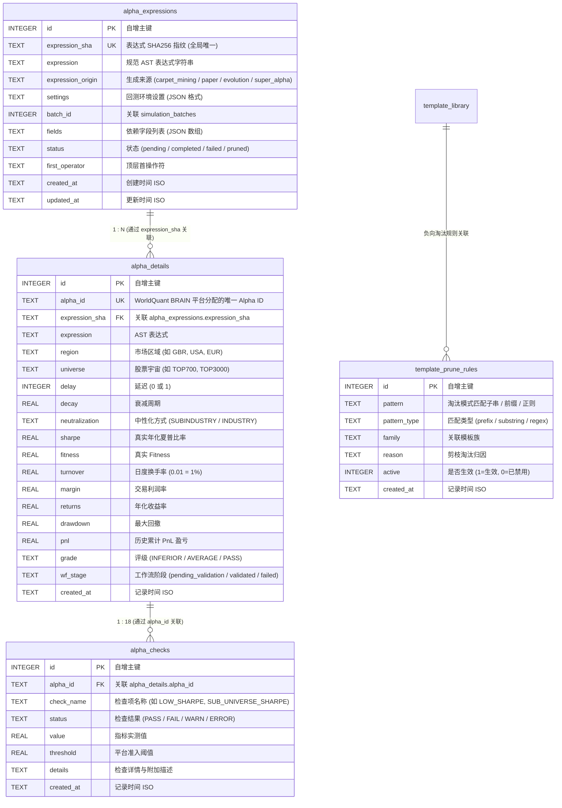

# Alpha 研究主数据库架构与设计规范 (Database Design Document)

本文档定义 **Alpha Factor Operator Framework** 主数据库 [`data/alpha_research.db`](file:///d:/quant/alpha_factory/data/alpha_research.db) 的表结构、索引策略、关联模型与并发安全控制。

---

## 一、 数据库定位与并发控制

### 1.1 存储引擎
- **SQLite 3.37+**：以单文件形式存储在 `data/alpha_research.db`，轻量、零维护、便携且具备强 ACID 事务保障。

### 1.2 高性能与 Windows 并发保障机制
针对 Windows 环境下多进程/多线程写入与锁争用，系统底层连接管理器内置如下优化：
1. **WAL 模式 (`PRAGMA journal_mode = WAL`)**：读写互不阻塞，读操作不持有排它锁；
2. **安全同步 (`PRAGMA synchronous = NORMAL`)**：大幅降低磁盘 I/O 延迟同时保证断电数据一致性；
3. **繁忙等待重试 (`PRAGMA busy_timeout = 30000`)**：设置 30 秒锁等待重试，消除 `sqlite3.OperationalError: database is locked`；
4. **幂等 DDL 守卫**：启动时检测关键表是否存在，若已初始化则直接跳过 `CREATE TABLE` / `ALTER TABLE`，杜绝重复 DDL 锁表。

### 1.3 数据库代码库零提交策略与一键初始化脚本
- **Git 忽略规范**：二进制数据库文件（`*.db`, `*.db-wal`, `*.db-shm`）严禁提交至 Git 仓库，保证代码库纯净轻量；
- **一键初始化与校验工具**：
  ```bash
  python init_db.py           # 默认在本地初始化或增量更新 data/alpha_research.db
  python init_db.py --verify  # 校验当前数据库完整性与已应用的 Schema 版本
  python init_db.py --reset   # 清空并全新初始化数据库
  # 或通过统一 CLI:
  python alpha_machine.py init-db --verify
  ```

### 1.4 数据库智能清理与磁盘整理维护
系统提供细粒度清理工具，支持淘汰项清除、全量重置与 SQLite 空间回收：
- **常用清理指令**：
  ```bash
  python clean_db.py                  # 清理失败/异常任务并执行 VACUUM 释放空间 (默认)
  python clean_db.py --mode stale     # 清理失败项、被剪枝项与孤儿数据
  python clean_db.py --mode all_data  # 清空所有历史回测数据 (保留表结构与模板库)
  python clean_db.py --dry-run        # 仅预览预计清理条目数，不实际删除
  # 或通过统一 CLI:
  python alpha_machine.py clean-db --mode stale
  ```

---

## 二、 实体关系图 (Entity Relationship Diagram)



---

## 三、 数据表详细结构与字段字典

### 表 1: `alpha_expressions` (表达式基因主表)

存储所有通过 AST 编译器合成或提炼的规范化表达式，基于 `expression_sha` 唯一索引天然排重。

| 字段名 | 数据类型 | 约束 | 业务说明 |
| :--- | :---: | :---: | :--- |
| `id` | INTEGER | PRIMARY KEY | 自增序列 |
| `expression_sha` | TEXT | NOT NULL UNIQUE | 规范化表达式的 SHA256 哈希值 |
| `expression` | TEXT | NOT NULL | 规范化 FASTEXPR 表达式字符串 |
| `expression_origin` | TEXT | DEFAULT '' | 来源标记 (`carpet_mining:*`, `paper:*`, `evolution:*`, `super_alpha:*`) |
| `settings` | TEXT | NOT NULL | 默认回测设置字典 JSON |
| `batch_id` | INTEGER | NULL | 关联的批次任务 ID |
| `fields` | TEXT | NOT NULL | 引用的原子字段 JSON 数组 |
| `status` | TEXT | CHECK IN (...) | `pending` / `completed` / `failed` / `pruned` |
| `first_operator` | TEXT | DEFAULT '' | 顶层操作符名称（用于分层抽样） |
| `created_at` | TEXT | NOT NULL | 录入时间戳 (ISO 8601) |
| `updated_at` | TEXT | NOT NULL | 最后状态更新时间戳 |

---

### 表 2: `alpha_details` (真实回测表现库)

记录在 WorldQuant BRAIN 官方服务器完成模拟回测的因子明细与核心统计量。

| 字段名 | 数据类型 | 约束 | 业务说明 |
| :--- | :---: | :---: | :--- |
| `id` | INTEGER | PRIMARY KEY | 自增序列 |
| `alpha_id` | TEXT | NOT NULL UNIQUE | BRAIN 平台分配的全局唯一 ID (如 `9qXQPxOK`) |
| `expression_sha` | TEXT | NOT NULL | 关联 `alpha_expressions.expression_sha` |
| `expression` | TEXT | NOT NULL | 提交的实际表达式 |
| `region` | TEXT | NOT NULL | 市场区域 (如 `GBR`) |
| `universe` | TEXT | NOT NULL | 股票宇宙 (如 `TOP700`) |
| `delay` | INTEGER | DEFAULT 1 | 调仓延迟 (0 或 1) |
| `decay` | REAL | DEFAULT 0 | 衰减周期 |
| `neutralization` | TEXT | NOT NULL | 中性化类型 (如 `SUBINDUSTRY`) |
| `sharpe` | REAL | NOT NULL | 样本内年化夏普比率 (IS Sharpe) |
| `fitness` | REAL | NOT NULL | 因子健康度指标 (Fitness) |
| `turnover` | REAL | NOT NULL | 日均换手率 (如 0.195 代表 19.5%) |
| `margin` | REAL | DEFAULT 0 | 利润率 (Margin) |
| `returns` | REAL | DEFAULT 0 | 样本内年化收益率 (Returns) |
| `drawdown` | REAL | DEFAULT 0 | 样本内最大回撤 (Drawdown) |
| `pnl` | REAL | DEFAULT 0 | 累计盈亏金额 ($ USD) |
| `wf_stage` | TEXT | DEFAULT 'pending_validation' | 工作流状态 (`pending_validation` / `validated` / `failed`) |
| `created_at` | TEXT | NOT NULL | 回测入库时间戳 |

---

### 表 3: `alpha_checks` (平台 18 项 Checks 终审审计表)

详尽记录针对每个 Alpha 触发的 18 项平台硬性指标检验。

| 字段名 | 数据类型 | 约束 | 业务说明 |
| :--- | :---: | :---: | :--- |
| `id` | INTEGER | PRIMARY KEY | 自增序列 |
| `alpha_id` | TEXT | NOT NULL | 关联 `alpha_details.alpha_id` |
| `check_name` | TEXT | NOT NULL | 检查项 (`LOW_SHARPE`, `SUB_UNIVERSE_SHARPE`, `HIGH_TURNOVER`, etc.) |
| `status` | TEXT | NOT NULL | `PASS` / `FAIL` / `WARN` / `ERROR` |
| `value` | REAL | NULL | 实测指标标量值 |
| `threshold` | REAL | NULL | 平台准入阈值 |
| `details` | TEXT | DEFAULT '' | 详细报错原因或上下文 |
| `created_at` | TEXT | NOT NULL | 审计时间戳 |

---

### 表 4: `template_prune_rules` (模板剪枝与负向学习表)

用于自进化闭环中记录被证明为噪声或零信号的表达式模式。

| 字段名 | 数据类型 | 约束 | 业务说明 |
| :--- | :---: | :---: | :--- |
| `id` | INTEGER | PRIMARY KEY | 自增序列 |
| `pattern` | TEXT | NOT NULL | 匹配模式（前缀、正则或子串） |
| `pattern_type` | TEXT | NOT NULL | `prefix` / `substring` / `regex` |
| `family` | TEXT | DEFAULT '' | 关联的模板族名称 |
| `reason` | TEXT | NOT NULL | 淘汰原因说明（如“二次差分放大噪声，实测 Sharpe=0.0”） |
| `active` | INTEGER | DEFAULT 1 | 是否启用过滤 (1=是, 0=否) |
| `created_at` | TEXT | NOT NULL | 规则创建时间 |

---

## 四、 核心索引策略

```sql
-- 1. 表达式去重与状态过滤索引
CREATE UNIQUE INDEX IF NOT EXISTS uq_expr_sha ON alpha_expressions(expression_sha);
CREATE INDEX IF NOT EXISTS idx_expr_status ON alpha_expressions(status);
CREATE INDEX IF NOT EXISTS idx_expr_first_op ON alpha_expressions(first_operator);
CREATE INDEX IF NOT EXISTS idx_expr_created ON alpha_expressions(created_at);

-- 2. 回测详情检索与排行榜索引
CREATE UNIQUE INDEX IF NOT EXISTS uq_detail_alpha_id ON alpha_details(alpha_id);
CREATE INDEX IF NOT EXISTS idx_detail_expr_sha ON alpha_details(expression_sha);
CREATE INDEX IF NOT EXISTS idx_detail_sharpe ON alpha_details(sharpe DESC);
CREATE INDEX IF NOT EXISTS idx_detail_region_universe ON alpha_details(region, universe);

-- 3. Checks 终审审计索引
CREATE INDEX IF NOT EXISTS idx_checks_alpha_id ON alpha_checks(alpha_id);
CREATE INDEX IF NOT EXISTS idx_checks_name_status ON alpha_checks(check_name, status);

-- 4. 剪枝规则索引
CREATE INDEX IF NOT EXISTS idx_prune_active ON template_prune_rules(active);
```
