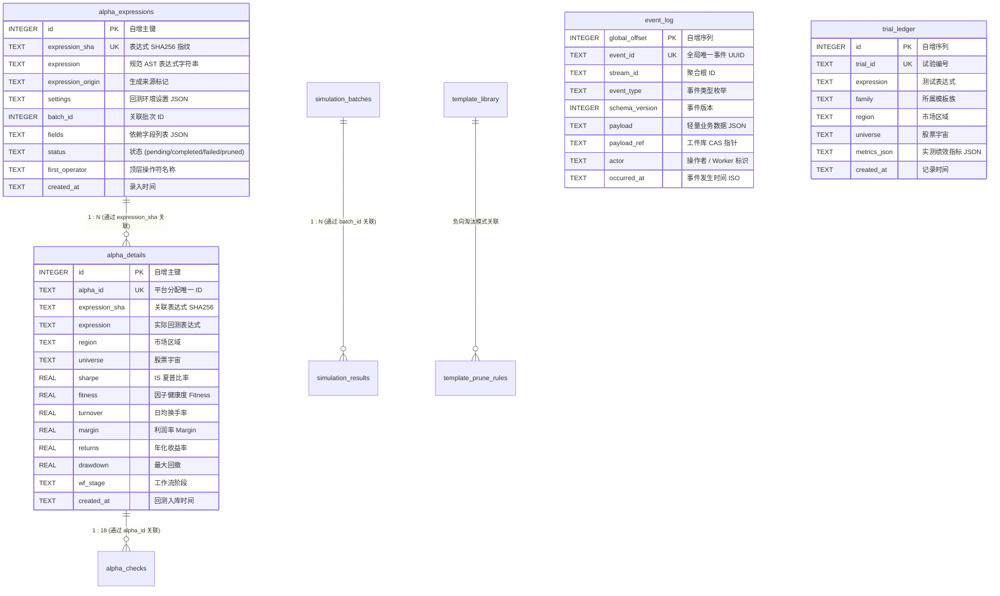

# Alpha 研究主数据库架构与设计规范 (Database Design Document)

本文档定义 **Alpha Factor Operator Framework** 主数据库 [`data/alpha_research.db`](file:///d:/quant/alpha_factory/data/alpha_research.db) 的全量核心数据表/视图结构、索引规划、关联模型、并发调优与运维指南。

---

## 一、 数据库定位与并发控制

### 1.1 存储引擎与架构定位
- **SQLite 3.37+**：以单文件形式存储在 `data/alpha_research.db`，轻量、零维护、便携且具备强 ACID 事务保障。
- **单一事实来源 (Single Source of Truth)**：承载全生命周期的 AST 表达式基因、平台回测绩效、18 项 Checks 审计、事件溯源流、试验账本与自进化规则。

### 1.2 高性能与 Windows 并发保障机制
针对 Windows 环境下多进程/多线程写入与锁争用，系统底层连接管理器内置如下优化：
1. **WAL 模式 (`PRAGMA journal_mode = WAL`)**：读写互不阻塞，读操作不持有排它锁；
2. **安全同步 (`PRAGMA synchronous = NORMAL`)**：大幅降低磁盘 I/O 延迟同时保证断电数据一致性；
3. **繁忙等待重试 (`PRAGMA busy_timeout = 30000`)**：设置 30 秒锁等待重试，消除 `sqlite3.OperationalError: database is locked`；
4. **幂等 DDL 守卫**：启动时检测关键表是否存在，若已初始化则直接跳过 `CREATE TABLE` / `ALTER TABLE`，杜绝重复 DDL 锁表。

### 1.3 数据库代码库零提交策略 (Zero-Commit Policy)
- **Git 忽略规范**：二进制数据库文件（`*.db`, `*.db-wal`, `*.db-shm`, `data/*.db`）严格加入 `.gitignore`，严禁提交至 Git 仓库，保证代码库纯净轻量；
- **一键初始化与校验工具**：
  ```bash
  python init_db.py           # 默认在本地初始化或增量更新 data/alpha_research.db
  python init_db.py --verify  # 校验当前数据库完整性与已应用的 Schema 版本
  python init_db.py --reset   # 清空并全新初始化数据库 (重新填充 30+ 模板种子)
  # 或通过统一 CLI:
  python alpha_machine.py init-db --verify
  ```

### 1.4 数据库智能清理与物理空间彻底释放 (VACUUM)
系统提供细粒度清理工具，支持淘汰项清除、全量重置与 SQLite 空间物理回收：
- **常用清理指令**：
  ```bash
  python clean_db.py                  # 清理失败/异常任务并执行 VACUUM 释放空间 (默认)
  python clean_db.py --mode stale     # 清理失败项、被剪枝项与孤儿数据
  python clean_db.py --mode all_data  # 清空所有历史回测数据 (保留表结构与模板库)
  python clean_db.py --mode stale --dry-run  # 仅预览预计清理条目数，不实际删除
  # 或通过统一 CLI:
  python alpha_machine.py clean-db --mode stale
  ```

### 1.5 全局数据库配置中心与存储解耦 (MySQL / PostgreSQL 迁移架构)
系统通过 `alpha_operator_framework/database/config.py` 实现了全局数据库配置中心：
- **统一单例与默认路径**：默认指向 `data/alpha_research.db`，所有模块（Repository、EventStore、TrialLedger、CLI）统一通过 `get_database_path()` / `get_database_config()` 获取；
- **环境变量一键覆盖**：
  - `ALPHA_DATABASE_PATH`: 自定义 SQLite 数据库文件绝对/相对路径；
  - `ALPHA_DATABASE_URL`: 标准数据库连接 URL（支持 `sqlite:///`、`mysql://`、`postgresql://`）。
- **极高内聚与低耦合封装**：所有数据库连接管理、驱动适配、SQL 语句与事务提交 100% 封装在 `alpha_operator_framework/database/` 模块内部。上层领域与应用层完全不直接接触原生 SQL。

---

## 二、 实体关系图 (Entity Relationship Diagram)



---

## 三、 核心数据表结构清单

### 1. 表达式与回测表
- **`alpha_expressions`**: 存储所有经过 AST 编译器规范化的候选表达式、哈希指纹、来源与状态；
- **`alpha_details`**: 记录从 WorldQuant BRAIN 平台获取的真实回测指标（Sharpe, Fitness, Turnover, Margin, Returns, Drawdown 等）；
- **`alpha_checks`**: 记录每个 Alpha 的 18 项平台硬性 Checks（如 LOW_SHARPE, LOW_FITNESS, HIGH_TURNOVER 等）审计结果。

### 2. 批次调度与平台仿真表
- **`simulation_batches`**: 记录向平台提交的多仿真批次（`platform_batch_id`、`platform_location`、批次状态与进度）；
- **`simulation_results`**: 批次中每个子任务的执行明细与关联 `alpha_id`；
- **`super_alpha_candidates`**: 记录通过正交化与 HRP 算法生成的超级组合因子候选。

### 3. 自进化知识库与剪枝表
- **`template_library`**: 模板库，包含预置种子母版以及通过 `TemplateAbstractor` 自动反向蒸馏生成的 `{a}`, `{b}` 骨架；
- **`template_prune_rules`**: 2D 跨字段共识剪枝规则库，记录多字段连续失败的模板模式；
- **`field_signal_stats` / `pair_signal_stats` / `operator_signal_stats`**: 统计各字段、字段对与算子的实测命中率与平均绩效。

### 4. 事件溯源与试验账本表
- **`event_log`**: 事件溯源不可变事实流，记录全生命周期所有状态流转事件；
- **`trial_ledger`**: 持久化试验账本，记录所有回测与剪枝尝试，为 DSR/PSR/PBO 统计防过拟合提供多重检验基础；
- **`schema_version`**: 记录已应用的数据库版本与迁移时间戳。

---

## 四、 常用分析 SQL 查询速查

### 1. 查询 IS 夏普最高的前 10 个 Alpha
```sql
SELECT alpha_id, expression, sharpe, fitness, turnover, returns, drawdown, wf_stage
FROM alpha_details
ORDER BY sharpe DESC
LIMIT 10;
```

### 2. 查询各生成族群 (Family) 的胜率与平均夏普
```sql
SELECT e.expression_origin, COUNT(*) AS total_alphas,
       AVG(d.sharpe) AS avg_sharpe, MAX(d.sharpe) AS max_sharpe
FROM alpha_details d
JOIN alpha_expressions e ON d.expression_sha = e.expression_sha
GROUP BY e.expression_origin
ORDER BY avg_sharpe DESC;
```

### 3. 查看指定 Alpha 的 18 项 Checks 详细状态
```sql
SELECT check_name, result, value, "limit"
FROM alpha_checks
WHERE alpha_id = 'ALPHA_12345'
ORDER BY result ASC;
```
