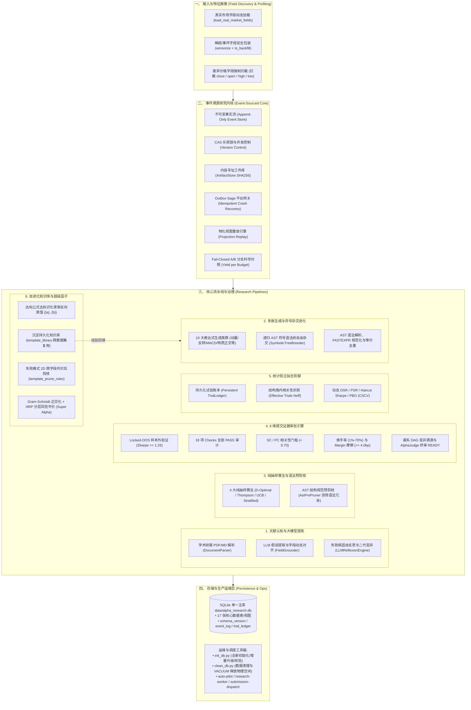

# Alpha Factory (Alpha Factor Operator Framework)

[](https://www.python.org/)
[-brightgreen.svg)]()
[](ARCHITECTURE.md)
[-orange.svg)](DATABASE_DESIGN.md)

工业级全生命周期量化 Alpha 因子研究与生产治理系统，深度对接 **WorldQuant BRAIN** 平台。系统融合**事件溯源不可变事实内核 (Event-Sourced Research Core)**、**领域驱动设计 (DDD)**、**Alpha AST 规范编译器**、**符号语法树自由杂交进化 (Symbolic Breeding)**、**大模型自主假说与反思闭环 (LLM Reflexion)**、**6 维证据准入状态机**、**动态 DSR 防过拟合引擎**、**Outbox Saga 异步平台网关**、**自进化知识库** 与 **生产高可用运维体系**。

---

## 📚 核心文档导航树 (Documentation Index)

| 核心文档 | 核心内容与定位 | 快速链接 |
| :--- | :--- | :---: |
| **项目主页** | 系统定位、技术架构全景、核心能力、极速上手 | [README.md](file:///d:/quant/alpha_factory/README.md) |
| **自进化实战指南** 🌟 | **全自主进化、符号语法树自由杂交、大模型自反思与知识闭环** | [autonomous_evolution_guide.md](file:///d:/quant/alpha_factory/docs/guides/autonomous_evolution_guide.md) |
| **快速上手** | 5 分钟极速入门、常用单行 CLI 命令备忘清单 | [QUICKSTART.md](file:///d:/quant/alpha_factory/QUICKSTART.md) |
| **系统架构设计** | DDD 领域分层、事件溯源内核、证据边界、防过拟合防御 | [ARCHITECTURE.md](file:///d:/quant/alpha_factory/ARCHITECTURE.md) |
| **权威使用手册** | 全流程命令详解（DDD周期、文献提炼、地毯挖掘、DB运维） | [USAGE_GUIDE.md](file:///d:/quant/alpha_factory/USAGE_GUIDE.md) |
| **数据库设计** | 17 张核心数据表/视图结构、WAL 优化、Zero-Commit 规范 | [DATABASE_DESIGN.md](file:///d:/quant/alpha_factory/DATABASE_DESIGN.md) |
| **专题与归档索引** | 分页指南、AI 集成、筛选优化、生产部署、历史评估报告全景 | [docs/INDEX.md](file:///d:/quant/alpha_factory/docs/INDEX.md) |

---

## 🌟 全生命周期 10 阶段投研流程与架构全景



---

## ⚡ 极速开始 (Quick Start)

### 1. 数据库初始化 (首次运行必做)
本框架执行**数据库零提交 (Zero-Commit) 规范**（`.db` 文件不提交 Git），克隆代码后需先执行初始化：
```bash
python init_db.py
# 或使用主 CLI:
python alpha_machine.py init-db
```

### 2. 执行完整自动化测试 (254 项测试 100% 通过)
```bash
python -m pytest -q
```

### 3. 小批崩溃恢复演练 (推荐在首次生产运行前执行)
```bash
python alpha_machine.py drill-recovery
```

### 4. 全新 DDD 10 阶段投研生命周期 (`research-cycle`) 🌟
支持 4 大纯抽样算法与 2D 跨字段共识剪枝：
```bash
# 默认 Dry-run 试运行 (推荐使用 D-Optimal 最大信息增益覆盖抽样)
python alpha_machine.py research-cycle \
    --region GBR --universe TOP700 \
    --algorithm d_optimal --sample-per-family 4

# 正式授权向 BRAIN 平台提交并发回测
python alpha_machine.py research-cycle \
    --region GBR --universe TOP700 \
    --algorithm d_optimal --sample-per-family 4 \
    --execute
```

### 5. 全自动无人值守投研流水线 (`auto-pilot`) 🚀
一键串联：环境自检 ➔ 真实并发回测 ➔ 6 维证据终审 ➔ 空间释放 (VACUUM) ➔ 汇总研报生成：
```bash
python alpha_machine.py auto-pilot \
    --region GBR --universe TOP700 \
    --datasets analyst7 \
    --sample-per-family 4 --batch-size 5 \
    --execute
```

### 6. 文献认知提取流水线 (`research`)
从学术论文或研报提取 Alpha 假说并自动对齐平台可用字段：
```bash
python alpha_machine.py research \
    --paper docs/academic_paper.pdf \
    --region GBR --universe TOP700 \
    --execute --output data/paper_research_report.md
```

### 7. 分层地毯式挖掘 (`mine`)
对指定另类数据集进行多模板族分层均衡抽样与流式回测：
```bash
python alpha_machine.py mine \
    --region GBR --universe TOP700 \
    --datasets "insider_agg_matrix,pattern_scores,fundamental31" \
    --sample-per-family 4 --batch-size 5 \
    --execute
```

### 8. 数据库清理与磁盘空间彻底释放 (VACUUM)
```bash
# 试运行查看待清理的失败与剪枝记录:
python clean_db.py --mode stale --dry-run

# 正式清理并执行 WAL 截断与 VACUUM 释放物理磁盘空间:
python clean_db.py --mode stale
```

---

## 💻 Python API 调用示例

```python
from alpha_operator_framework.application.research_cycle import (
    ResearchCycleRequest,
    ResearchCycleUseCase,
)
from alpha_operator_framework.infrastructure.sqlite import (
    SqliteExperimentRepository,
    SqliteKnowledgeRepository,
    SqliteResearchRepository,
)
from alpha_operator_framework.infrastructure.brain import BrainBacktestGateway
from alpha_operator_framework.infrastructure.submission import BrainSubmissionGateway
from alpha_operator_framework.infrastructure.telemetry import JsonLinesTelemetrySink

# 1. 初始化 DDD 仓储与网关
research_repo = SqliteResearchRepository()
experiment_repo = SqliteExperimentRepository()
knowledge_repo = SqliteKnowledgeRepository()
backtest_gateway = BrainBacktestGateway(execute=False)  # 默认安全 Dry-run
submission_gateway = BrainSubmissionGateway()
telemetry = JsonLinesTelemetrySink()

# 2. 组装用例并执行 10 阶段标准化投研周期
use_case = ResearchCycleUseCase(
    research_repo=research_repo,
    experiment_repo=experiment_repo,
    knowledge_repo=knowledge_repo,
    backtest_gateway=backtest_gateway,
    submission_gateway=submission_gateway,
    telemetry_sink=telemetry,
)

request = ResearchCycleRequest(
    region="GBR",
    universe="TOP700",
    algorithm="d_optimal",
    sample_per_family=4,
    execute=False,
)
result = use_case.execute(request)
print(f"✅ 投研周期完成: 生成 {len(result.round.candidates)} 个候选，入库 {len(result.batch.tasks)} 个任务")
```

---

## 📁 项目结构全景 (Directory Structure)

```text
d:\quant\alpha_factory/
├── README.md                      # [核心 1] 项目主页与核心能力总览
├── QUICKSTART.md                  # [核心 2] 5分钟极速上手与日常命令速查
├── ARCHITECTURE.md                # [核心 3] 系统架构全景 (DDD + 事件溯源 + 证据边界)
├── USAGE_GUIDE.md                 # [核心 4] 完整操作指南 (全流程命令详解与DB维护)
├── DATABASE_DESIGN.md             # [核心 5] 数据库全景架构与 17 表/视图设计规范
│
├── init_db.py                     # 数据库一键初始化/重置入口
├── clean_db.py                    # 数据库数据清理与 VACUUM 释放物理空间入口
├── alpha_machine.py               # 统一研究 CLI 入口 (research-cycle, auto-pilot, mine, research...)
├── run_autopilot.sh               # Linux/macOS 后台无人值守启动脚本
├── run_autopilot.ps1              # Windows PowerShell 后台无人值守启动脚本
│
├── alpha_operator_framework/      # 核心源码包
│   ├── application/               # 应用编排层 (ResearchCycleUseCase, ResearchRuntime, Worker)
│   ├── research/                  # 探索轮次与候选构造 (ResearchRound, 抽样算法, AstPrePruner, 文献流水线)
│   ├── experiment/                # 实验批次与评估治理 (ExperimentBatch 状态机, 6维硬门禁, NSGA2Mutator)
│   ├── knowledge/                 # 知识蒸馏与准入领域 (SignalDistiller, template_library, 提交审批)
│   ├── infrastructure/            # 基础设施适配器 (SQLite仓储, Brain网关, SubmissionOutbox, Telemetry)
│   ├── core/                      # 底层事件溯源内核 (EventStore, ArtifactStore CAS, Outbox Worker)
│   ├── domain/                    # 纯函数量化领域组件 (AST 编译器, 沙盒, 防过拟合 DSR/PSR/PBO, 裁决器)
│   ├── distill/                   # 信号聚合与模板抽象 (Diagnostic, Field/Operator 信号, TemplateAbstractor)
│   ├── generation/                # 假说与母版生成层 (CreationStrategy, TemplateLibrary, SuperAlpha)
│   ├── platform/                  # 平台通信层 (BrainClient, PlatformSimulator, SimulationTracker)
│   ├── database/                  # 数据库层 (AlphaDatabase 仓储, Cleaner, Models, Migrations, Schema/)
│   └── cache/                     # 平台元数据与算子缓存 (Datafields, Operators, Universes)
│
├── data/                          # 运行时数据目录 (.gitignore 忽略，由 init_db.py 生成)
│   └── alpha_research.db          # SQLite 统一主库 (17 张核心表/视图)
│
├── docs/                          # 分类专题文档库
│   ├── INDEX.md                   # 📚 文档全景导航与分类索引
│   ├── architecture/              # 🏗️ 架构与底层设计规范
│   ├── guides/                    # 📖 专项操作与集成指南
│   └── assessments/               # 📋 审计评审与历史报告
│
├── examples/                      # 示例与演练脚本
├── scripts/                       # 生产运维脚本 (Systemd 服务配置, Crontab 巡检矩阵)
└── tests/                         # 自动化测试套件 (254 个单元与集成测试, 100% 通过)
```

---

## 🔒 字段与数据合规声明
> [!IMPORTANT]
> **已弃用字段过滤提示**：平台已全面停用 `close`、`open`、`high`、`low` 等过时价格字段。本框架在 AST 编译器、动态字段对齐器及所有内置模板中**全面拦截并剔除 `close` 等字段**，统一使用 `returns`、`vwap`、`volume`、`market_cap`、`sharesout` 等标准收益流与量价字段。
