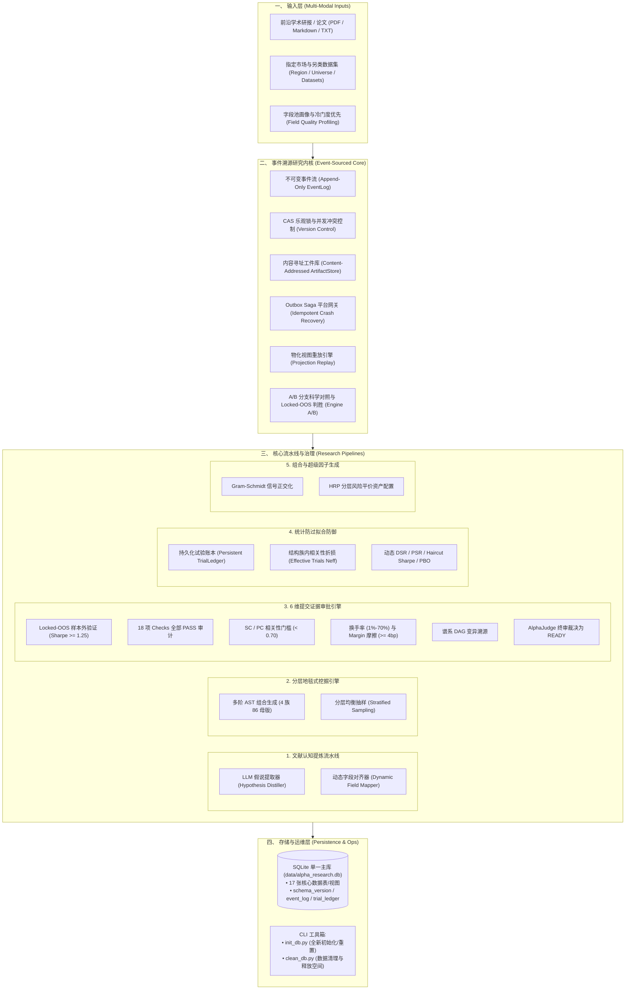

# Alpha Factory (Alpha Factor Operator Framework)

[](https://www.python.org/)
[-brightgreen.svg)]()
[](ARCHITECTURE.md)
[-orange.svg)](DATABASE_DESIGN.md)

工业级全生命周期量化 Alpha 因子研究与生产治理系统，深度对接 **WorldQuant BRAIN** 平台。系统融合**事件溯源不可变事实内核 (Event-Sourced Research Core)**、**领域驱动设计 (DDD)**、**AST 规范编译器**、**符号语法树自由杂交进化 (Symbolic Breeding)**、**大模型自主假说与反思闭环 (LLM Reflexion)**、**6 维证据准入状态机**、**动态 DSR 防过拟合引擎**、**Outbox Saga 异步平台网关** 与 **自进化知识库**。

---

## 📚 文档导航树 (Documentation Index)

| 核心文档 | 核心内容与定位 | 快速链接 |
| :--- | :--- | :---: |
| **项目主页** | 系统定位、技术架构全景、核心能力、极速上手 | [README.md](file:///d:/quant/alpha_factory/README.md) |
| **自进化实战指南** 🌟 | **全自主进化、符号语法树自由杂交、大模型自反思与知识闭环** | [autonomous_evolution_guide.md](file:///d:/quant/alpha_factory/docs/guides/autonomous_evolution_guide.md) |
| **快速上手** | 5 分钟极速入门、常用单行 CLI 命令备忘清单 | [QUICKSTART.md](file:///d:/quant/alpha_factory/QUICKSTART.md) |
| **系统架构** | DDD 领域分层、事件溯源内核、证据边界、防过拟合防御 | [ARCHITECTURE.md](file:///d:/quant/alpha_factory/ARCHITECTURE.md) |
| **权威使用手册** | 全流程命令详解（文献提炼、地毯挖掘、A/B对照、DB运维） | [USAGE_GUIDE.md](file:///d:/quant/alpha_factory/USAGE_GUIDE.md) |
| **数据库设计** | 17 张核心数据表/视图结构、WAL 优化、Zero-Commit 规范 | [DATABASE_DESIGN.md](file:///d:/quant/alpha_factory/DATABASE_DESIGN.md) |
| **专题与归档** | 分页指南、AI 集成、筛选优化、历史评估报告全景索引 | [docs/INDEX.md](file:///d:/quant/alpha_factory/docs/INDEX.md) |

---

## 🌟 系统核心能力与架构全景



---

## ⚡ 极速开始 (Quick Start)

### 1. 数据库初始化 (首次运行必做)
本框架执行**数据库零提交 (Zero-Commit) 规范**，克隆代码后需先执行初始化：
```bash
python init_db.py
# 或使用主 CLI:
python alpha_machine.py init-db
```

### 2. 执行完整单元与集成测试 (172 项)
```bash
python -m pytest
```

### 3. 小批崩溃恢复演练 (推荐在首次生产运行前执行)
```bash
python alpha_machine.py drill-recovery
```

### 3. 文献认知提取流水线 (Literature Research)
从学术论文或研报提取 Alpha 假说并自动对齐平台可用字段：
```bash
python alpha_machine.py run-research \
    --paper-path docs/academic_paper.pdf \
    --region GBR --universe TOP700 \
    --execute
```

### 4. 分层地毯式挖掘 (Stratified Carpet Mining)
对英国市场 `analyst7` 数据集进行全模板族地毯式扫描回测：
```bash
python alpha_machine.py carpet-mine \
    --region GBR --universe TOP700 \
    --dataset analyst7 \
    --batch-size 10 \
    --execute
```

### 5. 候选因子 6 维证据终审与提交审计
```bash
python alpha_machine.py evaluate-candidates \
    --min-sharpe 1.25 --min-fitness 1.0 \
    --auto-promote
```

### 6. 数据库清理与磁盘空间彻底释放 (VACUUM)
```bash
# 试运行查看待清理的失败与剪枝记录:
python clean_db.py --failed --pruned --dry-run

# 正式清理并执行 WAL 截断与 VACUUM:
python clean_db.py --failed --pruned --vacuum
```

---

## 💻 Python API 调用示例

```python
import asyncio
from alpha_operator_framework.core.engine import EventSourcedResearchEngine
from alpha_operator_framework.core.policy import ResearchPolicy, ValidationPartitions
from alpha_operator_framework.domain.evidence import SubmissionApprovalEngine, EvidenceLevel

# 1. 初始化事件溯源研究引擎
engine = EventSourcedResearchEngine()

# 2. 锁死研究时间窗口与策略
policy = ResearchPolicy(
    policy_id="gbr_analyst_reversion",
    region="GBR",
    universe="TOP700",
    validation=ValidationPartitions(
        discovery_is=["2016-01-01", "2021-12-31"],
        validation=["2022-01-01", "2023-12-31"],
        locked_oos=["2024-01-01", "2025-12-31"],
    ),
)
graph = engine.create_experiment(policy)

# 3. 计划候选因子并触发 Outbox 幂等仿真
candidates = [
    {"expression": "ts_rank(returns, 22)", "family": "momentum"},
    {"expression": "reverse(rank(vwap))", "family": "mean_reversion"},
]
emitted_shas = engine.plan_and_simulate(graph, policy, candidates)
print(f"✅ 生成并完成仿真: {len(emitted_shas)} 个候选因子")

# 4. 执行 6 维提交证据审批
report = SubmissionApprovalEngine.evaluate(
    alpha_id="ALPHA_12345",
    evidence_level=EvidenceLevel.PLATFORM_OS,
    is_metrics={"sharpe": 1.58, "fitness": 1.32, "turnover": 0.18, "margin": 7.5},
    oos_metrics={"sharpe": 1.42},
    checks=[{"name": "LOW_SHARPE", "result": "PASS"}],
    sc_value=0.22,
    pc_value=0.18,
    judge_verdict="READY",
)
if report.approved:
    print("🚀 因子完全达标 SUBMISSION_READY，进入正式提交池！")
else:
    print(f"⚠️ 终审未通过，原因: {report.rejection_reasons}")
```

---

## 📁 项目结构全景 (Directory Structure)

```text
d:\quant\alpha_factory/
├── README.md                      # [核心 1] 项目主页与核心能力总览
├── QUICKSTART.md                  # [核心 2] 5分钟极速上手与日常命令速查
├── ARCHITECTURE.md                # [核心 3] 系统架构全景 (DDD + 事件溯源 + 证据边界)
├── USAGE_GUIDE.md                 # [核心 4] 完整操作指南 (全命令详解与DB维护)
├── DATABASE_DESIGN.md             # [核心 5] 数据库全景架构与 17 表/视图设计规范
│
├── init_db.py                     # 数据库一键初始化/重置入口
├── clean_db.py                    # 数据库数据清理与 VACUUM 释放空间入口
├── alpha_machine.py               # 统一研究 CLI 入口 (init-db, clean-db, run-research, carpet-mine...)
│
├── alpha_operator_framework/      # 核心源码包
│   ├── core/                      # 事件溯源研究内核 (events, event_store, artifacts, outbox, engine...)
│   ├── domain/                    # 领域层 (evidence 证据边界, ast 编译器, judge 评级, overfitting 防过拟合)
│   ├── generation/                # 假说与母版生成层 (hypothesis, template_library, templates)
│   ├── platform/                  # 平台通信层 (platform_simulator, brain_client, session)
│   ├── research/                  # 研发流水线编排层 (literature_pipeline, stratified_miner, db_persister)
│   └── database/                  # 数据库层 (repository, init_db, cleaner, schema/)
│
├── data/                          # 运行时数据目录 (.gitignore 忽略，由 init_db.py 生成)
│   └── alpha_research.db          # SQLite 统一主库 (17 张表/视图)
│
├── docs/                          # 分类专题文档库
│   ├── INDEX.md                   # 📚 文档全景导航与分类索引
│   ├── architecture/              # 🏗️ 架构与底层设计规范
│   ├── guides/                    # 📖 专项操作与集成指南
│   └── assessments/               # 📋 审计评审与历史报告
│
└── tests/                         # 自动化测试套件 (171 个单元与集成测试, 100% 通过)
```

---

## 🔒 字段与数据合规声明
> [!IMPORTANT]
> **已弃用字段过滤提示**：平台已全面停用 `close`、`open`、`high`、`low` 等过时价格字段。本框架在 AST 编译器、动态字段对齐器及所有内置模板中**全面拦截并剔除 `close` 等字段**，统一使用 `returns`、`vwap`、`volume`、`market_cap`、`sharesout` 等标准收益流与量价字段。
