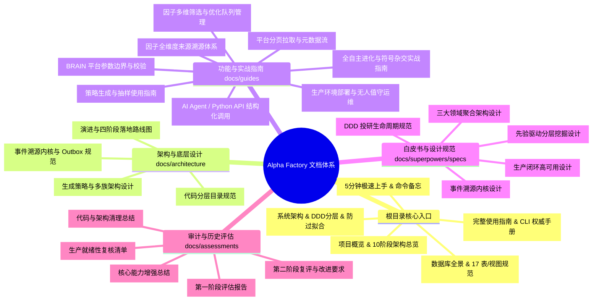

# Alpha Factory 文档全景索引与导航 (Documentation Index)

欢迎查阅 **Alpha Factory**（基于事件溯源不可变事实内核与领域驱动设计的 WorldQuant BRAIN 全生命周期量化 Alpha 投研工业级框架）文档库。

---

## 🧭 文档全景导航与受众导读

---

## 📌 核心文档分类速览

### 1. 根目录主文档 (Core Entrypoints)

| 文档 | 定位与核心内容 | 适用对象 |
| :--- | :--- | :--- |
| [**README.md**](file:///d:/quant/alpha_factory/README.md) | 项目简介、10 阶段全流程架构全景、核心能力亮点、环境要求与快速运行。 | 全体量化开发者 / AI Agent |
| [**QUICKSTART.md**](file:///d:/quant/alpha_factory/QUICKSTART.md) | 5 分钟极速上手、全套 254 项测试运行、常用单行 CLI 命令备忘清单。 | 新人入门 / 常用操作速查 |
| [**ARCHITECTURE.md**](file:///d:/quant/alpha_factory/ARCHITECTURE.md) | DDD 领域分层模型、事件溯源内核、证据等级边界、防过拟合防御网 (DSR/PSR/PBO)。 | 架构师 / 核心量化开发人员 |
| [**USAGE_GUIDE.md**](file:///d:/quant/alpha_factory/USAGE_GUIDE.md) | 全套 CLI 子命令参数详解、10 大实战场景（DDD周期/文献/地毯/SuperAlpha/DB运维）。 | 日常投研人员 / 运维人员 |
| [**DATABASE_DESIGN.md**](file:///d:/quant/alpha_factory/DATABASE_DESIGN.md) | SQLite `data/alpha_research.db` 17 张核心表/视图设计、WAL 优化、Zero-Commit 规范。 | 数据库工程人员 / 运维人员 |

---

### 2. 架构与底层设计 (`docs/architecture/`)

| 文档 | 核心内容 |
| :--- | :--- |
| [**event_sourced_core.md**](file:///d:/quant/alpha_factory/docs/architecture/event_sourced_core.md) | 事件溯源不可变事实流、CAS 乐观锁、Outbox Saga 模式、物化视图投影与 A/B 分支科学对照。 |
| [**directory_design.md**](file:///d:/quant/alpha_factory/docs/architecture/directory_design.md) | 代码库分层目录设计规范与 DDD 限界上下文包隔离准则。 |
| [**roadmap_and_evolution.md**](file:///d:/quant/alpha_factory/docs/architecture/roadmap_and_evolution.md) | 框架演进历史、四阶段落地全景（AST引擎、防过拟合、Super Alpha、DDD 闭环）与路线图。 |
| [**strategy_architecture.md**](file:///d:/quant/alpha_factory/docs/architecture/strategy_architecture.md) | 10 大生成族群、AST 符号杂交、抽样算法与策略组件化架构。 |

---

### 3. 功能与专项实战指南 (`docs/guides/`)

| 文档 | 核心内容 |
| :--- | :--- |
| [**autonomous_evolution_guide.md**](file:///d:/quant/alpha_factory/docs/guides/autonomous_evolution_guide.md) | **全自主进化实战指南**: 符号语法树自由杂交、大模型自反思闭环、模板自动反向蒸馏与知识库迁移。 |
| [**production_deployment_guide.md**](file:///d:/quant/alpha_factory/docs/guides/production_deployment_guide.md) | **生产环境部署与运维手册**: Systemd 守护进程、Crontab 定时矩阵巡检、PowerShell 自动化与容灾恢复。 |
| [**ai_integration.md**](file:///d:/quant/alpha_factory/docs/guides/ai_integration.md) | 面向大模型与自主 Agent 的结构化 API 接口、参数控制与异步调用范式（已净化过时字段）。 |
| [**alpha_filtering.md**](file:///d:/quant/alpha_factory/docs/guides/alpha_filtering.md) | 候选 Alpha 多维条件过滤、高质量/边缘池筛选与优化队列分派。 |
| [**alpha_source_guide.md**](file:///d:/quant/alpha_factory/docs/guides/alpha_source_guide.md) | 因子来源溯源体系（研报提炼、地毯挖掘、符号杂交、知识库回填、超级因子）。 |
| [**platform_config.md**](file:///d:/quant/alpha_factory/docs/guides/platform_config.md) | BRAIN 平台市场、股票池、中性化选项、参数边界与配置校验。 |
| [**pagination_guide.md**](file:///d:/quant/alpha_factory/docs/guides/pagination_guide.md) | 平台海量数据字段分页拉取、缓存加速与全量元数据持久化。 |
| [**strategy_usage.md**](file:///d:/quant/alpha_factory/docs/guides/strategy_usage.md) | 策略生成组件的使用方法与参数调优指南。 |

---

### 4. 架构规范与设计白皮书 (`docs/superpowers/specs/`)

| 文档 | 核心内容 |
| :--- | :--- |
| [**2026-08-23-research-round-domain-design.md**](file:///d:/quant/alpha_factory/docs/superpowers/specs/2026-08-23-research-round-domain-design.md) | **三大核心领域聚合架构设计**: `ResearchRound`、`ExperimentBatch` 与 `KnowledgeBase` 领域模型与纯策略规范。 |
| [**2026-08-23-production-research-loop-design.md**](file:///d:/quant/alpha_factory/docs/superpowers/specs/2026-08-23-production-research-loop-design.md) | **生产投研闭环高可用设计**: 幂等回测批次、显式状态机生命周期、Pareto 突变与安全上线外箱。 |
| [**2026-08-23-ddd-research-cycle-design.md**](file:///d:/quant/alpha_factory/docs/superpowers/specs/2026-08-23-ddd-research-cycle-design.md) | **DDD 领域驱动设计投研生命周期架构规范**: 纯抽样算法族与 2D 跨字段共识后剪枝规范。 |
| [**2026-08-21-event-sourced-research-core-design.md**](file:///d:/quant/alpha_factory/docs/superpowers/specs/2026-08-21-event-sourced-research-core-design.md) | 事件溯源研究内核与 Outbox Saga 异步平台网关架构设计。 |
| [**2026-08-21-prior-driven-research-layered-design.md**](file:///d:/quant/alpha_factory/docs/superpowers/specs/2026-08-21-prior-driven-research-layered-design.md) | 先验驱动的分层地毯式挖掘与多阶 AST 组合架构设计。 |

---

### 5. 审计与历史评估报告 (`docs/assessments/`)

| 文档 | 核心内容 |
| :--- | :--- |
| [**PROJECT_ASSESSMENT_2026-08-21.md**](file:///d:/quant/alpha_factory/docs/assessments/PROJECT_ASSESSMENT_2026-08-21.md) | 2026-08-21 第一阶段系统架构与科学性全面评估。 |
| [**REASSESSMENT_2026-08-21.md**](file:///d:/quant/alpha_factory/docs/assessments/REASSESSMENT_2026-08-21.md) | 2026-08-21 第二阶段复评（证据边界防御、Outbox 恢复、真实批处理）。 |
| [**PRODUCTION_READINESS_2026-08-21.md**](file:///d:/quant/alpha_factory/docs/assessments/PRODUCTION_READINESS_2026-08-21.md) | 2026-08-21 生产运行就绪性复核与真实平台故障处置清单。 |
| [**code_cleanup_summary.md**](file:///d:/quant/alpha_factory/docs/assessments/code_cleanup_summary.md) | 模块瘦身、冗余代码清理与工程规范化记录。 |
| [**improvement_summary.md**](file:///d:/quant/alpha_factory/docs/assessments/improvement_summary.md) | 核心算法演进与系统效能提升历史总结。 |
| [**project_summary.md**](file:///d:/quant/alpha_factory/docs/assessments/project_summary.md) | 项目阶段里程碑成果汇总。 |
| [**strategy_summary.md**](file:///d:/quant/alpha_factory/docs/assessments/strategy_summary.md) | 模板族策略覆盖度与有效性统计分析。 |
