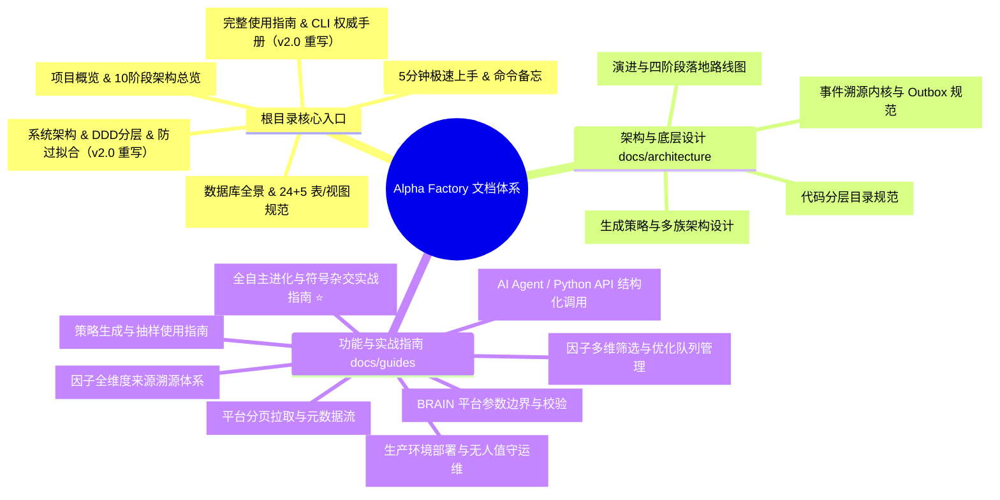

# Alpha Factory 文档全景索引与导航 (Documentation Index)

欢迎查阅 **Alpha Factory** 文档库。

---

## 🧭 文档全景导航

---

## 📌 核心文档分类速览

### 1. 根目录主文档 (Core Entrypoints)

| 文档 | 定位与核心内容 | 适用对象 |
| :--- | :--- | :--- |
| [**README.md**](../README.md) | 项目简介、10 阶段全流程架构全景、核心能力亮点、快速运行 | 全体量化开发者 |
| [**QUICKSTART.md**](../QUICKSTART.md) | 5 分钟极速上手、全套测试运行、常用单行 CLI 命令备忘清单 | 新人入门 / 常用操作速查 |
| [**ARCHITECTURE.md**](../ARCHITECTURE.md) ✨ | **v2.0 重写**：DDD 五层架构、事件溯源内核、证据边界、防过拟合体系、数据库、CLI 架构 | 架构师 / 核心量化开发人员 |
| [**USAGE_GUIDE.md**](../USAGE_GUIDE.md) ✨ | **v2.0 重写**：22 个 CLI 命令完整参数、6 大实战场景、Python API、SQL 速查、FAQ | 日常投研人员 / 运维人员 |
| [**DATABASE_DESIGN.md**](../DATABASE_DESIGN.md) | SQLite `data/alpha_research.db` 24 张核心表/视图 + 5 张运行时表设计、WAL 优化、Zero-Commit 规范 | 数据库工程人员 / 运维人员 |

---

### 2. 架构与底层设计 (`docs/architecture/`)

| 文档 | 核心内容 |
| :--- | :--- |
| [**event_sourced_core.md**](architecture/event_sourced_core.md) | 事件溯源不可变事实流、CAS 乐观锁、Outbox Saga 模式、物化视图投影与 A/B 分支科学对照 |
| [**directory_design.md**](architecture/directory_design.md) | 代码库分层目录设计规范与 DDD 限界上下文包隔离准则 |
| [**roadmap_and_evolution.md**](architecture/roadmap_and_evolution.md) | 框架演进历史、四阶段落地全景与路线图 |
| [**strategy_architecture.md**](architecture/strategy_architecture.md) | 10 大生成族群、AST 符号杂交、抽样算法与策略组件化架构 |

---

### 3. 功能与专项实战指南 (`docs/guides/`)

| 文档 | 核心内容 |
| :--- | :--- |
| [**autonomous_evolution_guide.md**](guides/autonomous_evolution_guide.md) ⭐ | **全自主进化实战指南**: 符号语法树自由杂交、大模型自反思闭环、模板自动反向蒸馏与知识库迁移 |
| [**production_deployment_guide.md**](guides/production_deployment_guide.md) | **生产环境部署与运维手册**: Systemd 守护进程、Crontab 定时矩阵巡检、PowerShell 自动化与容灾恢复 |
| [**ai_integration.md**](guides/ai_integration.md) | 面向大模型与自主 Agent 的结构化 API 接口与异步调用范式 |
| [**alpha_filtering.md**](guides/alpha_filtering.md) | 候选 Alpha 多维条件过滤、高质量/边缘池筛选与优化队列分派 |
| [**alpha_source_guide.md**](guides/alpha_source_guide.md) | 因子来源溯源体系（研报提炼、地毯挖掘、符号杂交、知识库回填、超级因子） |
| [**platform_config.md**](guides/platform_config.md) | BRAIN 平台市场、股票池、中性化选项、参数边界与配置校验 |
| [**pagination_guide.md**](guides/pagination_guide.md) | 平台海量数据字段分页拉取、缓存加速与全量元数据持久化 |
| [**strategy_usage.md**](guides/strategy_usage.md) | 策略生成组件的使用方法与参数调优指南 |
