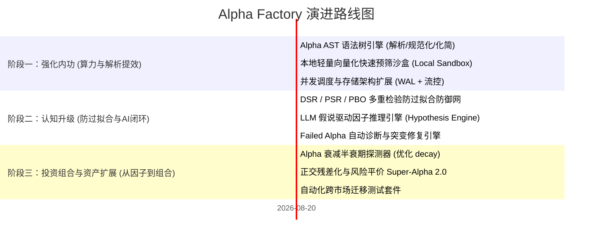

# Alpha Factory 框架演进与深度优化方案

> **编制日期**: 2026-08-20  
> **定位**: 面向系统化量化因子挖掘平台（WorldQuant BRAIN / 机构内盘平台）的下一代演进规划与落地路线图。

---

## 一、 总体评估与现有优势

当前 `Alpha Factory` 已具备专业量化基础设施的核心骨架：
1. **领域与网络完全解耦**：`domain/` 与 `distill/` 模块保持纯函数设计，零网络 IO，测试与单测可毫秒级完成。
2. **六阶段自学习闭环（Refinement Loop）**：首创沉淀字段命中率加权采样（6→1）、达标表达式骨架抽象回填（6→2）、零密度模板负向淘汰（6→2）的闭环自生长机制。
3. **防御性剪枝与配额管控**：内置语义剪枝、同字段 Top-K、本地自相关预检以及严格的 Dry-run 优先机制，保护平台回测配额。

---

## 二、 关键待优化项（Optimization Areas）

### 1. 表达式处理：从“字符串拼接”升级为“AST 抽象语法树”
- **现状痛点**：目前表达式生成、参数替换和模板抽象主要依赖字符串模板和正则匹配。
- **潜在风险**：
  - **语义等价但哈希不同**：例如 `rank(close) / rank(volume)` 与 `rank(close) * (1 / rank(volume))` 在数学上等价，但在 `expression_sha` 去重时会被视作两个不同的因子，重复消耗回测配额。
  - **冗余无效计算**：例如 `rank(rank(x))`、`zscore(zscore(x))` 或 `reverse(reverse(x))` 等无效嵌套在生成阶段难以彻底识别。
- **优化方案**：构建轻量级 **Alpha AST (Abstract Syntax Tree)** 解析与优化器，实现：
  - 静态类型推断（Matrix, Vector, Group, Scalar, Boolean）。
  - 代数与算子规范化（Canonical Form 化简），将表达式归一化后再计算 SHA256。
  - 冗余算子消除与常量折叠。

### 2. 过拟合防御与多重检验偏差（Data Snooping Bias）
- **现状痛点**：当前主要依赖单点阈值门控（Sharpe > 1.25, Fitness > 1.0, Margin > 5.0, Turnover < 70%）。
- **潜在风险**：在每天跑数千个公式的高频试错下，**“多重检验陷阱”（Multiple Testing Problem）** 极其严重。纯白噪声在多次尝试后也能跑出虚假的高夏普因子（In-Sample Overfitting）。
- **优化方案**：
  - **引入 DSR (Deflated Sharpe Ratio) 与 PSR (Probabilistic Sharpe Ratio)**：根据回测尝试的总次数（Trial Count）和因子的偏度/峰度，动态打折 Sharpe。
  - **PBO (Probability of Backtest Overfitting) 检验**：引入分块交叉验证（CSCV），评估因子在样本外崩溃的概率。
  - **FDR (False Discovery Rate / Benjamini-Hochberg) 门控**：在批量回测中动态调整显著性门槛。

### 3. 并发调度与存储架构扩展
- **现状痛点**：单机 SQLite (`alpha_research.db`) 配合文件锁，高并发写入时易发生锁争用；平台请求缺乏自适应流控。
- **优化方案**：
  - 存储抽象支持 SQLite / PostgreSQL / MySQL 无缝切换。
  - 基于自适应令牌桶（Token Bucket）的异步流控队列与 429 智能退避重试。

---

## 三、 核心新增功能清单

| 模块名称 | 核心功能与技术原理 | 优先级 |
| :--- | :--- | :---: |
| **1. Alpha AST 语法树引擎** | 表达式语法解析、规范型转换（Canonical Form）、等价算子化简、冗余嵌套剔除、精确类型检查。 | **✅ P0 (阶段一已落地)** |
| **2. 本地轻量向量化预筛沙盒 (Local Sandbox)** | 基于 NumPy/Polars 构建本地极速仿真沙盒，秒级计算 Rank IC/Sharpe，云端提交前淘汰无效因子，节省 70%+ 配额。 | **✅ P0 (阶段一已落地)** |
| **3. 并发调度与存储架构扩展 (WAL + RateLimiter)** | SQLite WAL 模式、线程安全连接池、异步自适应令牌桶流控 (AIMD 拥塞控制) 与优先级任务调度队列。 | **✅ P0 (阶段一已落地)** |
| **4. 假说驱动的 AI/LLM 认知推理引擎** | 摒弃排列组合盲目穷举，基于 5 大经典金融经济学假说体系（分析师预期修正、量价背离、盈利质量、极值反转、情绪关注度）定向生成高胜率 AST 因子。 | **✅ P1 (阶段二已落地)** |
| **5. 智能故障归因与自动突变修复** | 对回测失败 Alpha 自动归因诊断（高换手/子宇宙失效/高相关性/边缘夏普），触发针对性 AST 基因修复突变。 | **✅ P1 (阶段二已落地)** |
| **6. 统计防过拟合防御套件 (DSR/PSR/PBO/CSCV)** | 落地 Deflated Sharpe Ratio (DSR)、Probabilistic Sharpe Ratio (PSR)、Harvey-Liu-Zhu 打折夏普以及组合对称交叉验证 PBO。 | **✅ P1 (阶段二已落地)** |
| **7. 因子衰减半衰期探测 (Alpha Decay Profiler)** | 自相关与前向 IC 衰减曲线拟合，自动探测因子最佳半衰期，精确推荐 `decay` 参数。 | **✅ P2 (阶段三已落地)** |
| **8. 组合正交化残差化与风险平价融合** | Gram-Schmidt 正交化剥离已提交因子相关性，基于 HRP（分层风险平价）实现 Super-Alpha 2.0 组合。 | **✅ P2 (阶段三已落地)** |
| **9. 跨市场/跨资产鲁棒性迁移套件** | 自动化跨区域（USA / EUR / CHN / GBR / JPN）回测验证，筛选具有全市场生命力的通用 Alpha。 | **✅ P2 (阶段三已落地)** |

---

## 四、 三阶段落地演进路线图

