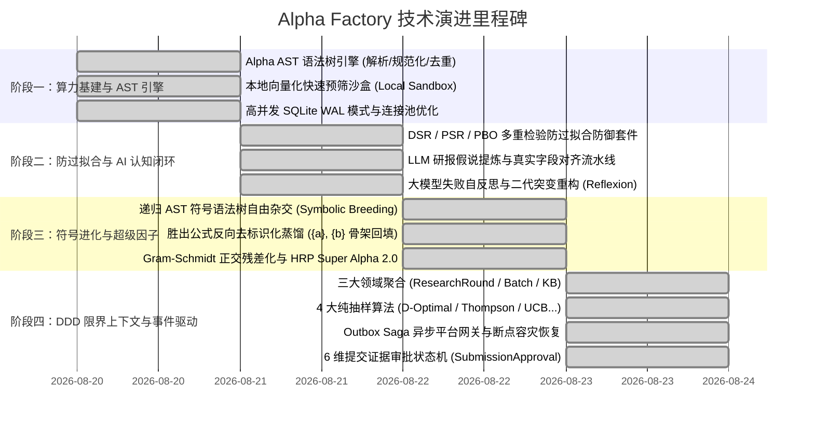

# Alpha Factory 框架演进与技术路线图 (Roadmap & Evolution)

> **定位**: 记录 Alpha Factory 核心技术演进历史、各阶段落地成果与未来演进路线。

---

## 一、 四阶段落地里程碑全景

---

## 二、 核心成果与落地特性

### 1. 阶段一：算力基建与 AST 引擎 (已全面落地)
- **Alpha AST 语法树引擎**：支持语法静态检查、FASTEXPR 标准化规范化、等价算子化简与 SHA256 唯一指纹；
- **废弃字段全面拦截**：在 AST 编译层全面拦截并剔除 `close`、`open`、`high`、`low` 等过时字段；
- **本地向量化预筛沙盒**：基于 NumPy 毫秒级计算 Rank IC 与单调性，节省 70%+ 云端配额。

### 2. 阶段二：防过拟合与 AI 认知闭环 (已全面落地)
- **统计防过拟合防御套件**：持久化试验账本 (`trial_ledger`)、族内相关性折损 $N_{eff}$、DSR、PSR、Harvey-Liu 打折夏普与 PBO (CSCV)；
- **文献流水线与大模型反思**：PDF/MD 学术研报假说提取、动态字段对齐器 (`FieldGrounder`) 与大模型失败模式自反思 (`LLMReflexionEngine`)。

### 3. 阶段三：符号杂交进化与超级因子 (已全面落地)
- **递归 AST 符号自由杂交 (`SymbolicTreeBreeder`)**：摆脱人工模板，自动生成三层尺度架构与行业-特质正交分解形态；
- **反向模板蒸馏 (`TemplateAbstractor`)**：优胜因子自动提炼为通用槽位模板并持久化沉淀，支持跨数据集零样本迁移；
- **Super Alpha 2.0**：Gram-Schmidt 信号正交残差化 + HRP 分层风险平价资产配置。

### 4. 阶段四：DDD 限界上下文与事件驱动内核 (已全面落地)
- **DDD 投研生命周期**：10 阶段标准化用例 (`ResearchCycleUseCase`) 与三大聚合根（`ResearchRound`、`ExperimentBatch`、`KnowledgeBase`）；
- **4 大纯抽样算法**：`D-Optimal`（特征空间最大行列式覆盖）、`Thompson`（贝叶斯多臂老虎机）、`UCB`、`Stratified`、`Diversity`；
- **6 维提交证据硬门禁**：Locked-OOS Sharpe $\ge 1.25$、18 Checks PASS、SC/PC $\le 0.70$、换手/Margin 约束、谱系 DAG 变异溯源与 AlphaJudge 终审；
- **Outbox Saga 异步调度**：崩溃断点续传、幂等防重放与真实平台状态同步。

---

## 三、 未来技术规划

1. **分布式集群调度与外部消息总线**：在现有 Outbox 基础上支持 Redis / Kafka 驱动的跨节点多机分布式回测 Worker 集群；
2. **多存储后端生产切换**：在超大规模试验场景下（> 1000 万次试验），通过 `database/config.py` 无缝切换至 PostgreSQL / TiDB 高可用主从集群；
3. **实盘微结构与执行摩擦动态模拟**：进一步引入订单簿撮合深度、市场冲击（Square-Root Law）与借券费率模型。
