# 因子生成策略与多族架构设计 (Strategy Architecture)

> **定位**: 阐述 Alpha Factory 因子表达式生成策略体系、10 大母版族群、AST 符号自由杂交与 DDD 抽样探索架构。

---

## 一、 策略架构总览

框架的因子生成已从早期的“硬编码字符串拼接”全面演进为 **AST 语法树驱动 + 10 大母版族群 + 符号语法树自由杂交 + DDD 多算法自适应抽样**：

```mermaid
flowchart TD
    subgraph INPUT["一、 输入层 (Field Inputs)"]
        F1["真实市场字段 (Matrix / Vector / Group)"]
        F2["稀疏/事件字段安全包装 (winsorize + ts_backfill)"]
        F3["合规拦截 (过滤 close / open 等废弃字段)"]
    end

    subgraph STRATEGIES["二、 生成策略体系 (Creation Strategies)"]
        S1["1. 模板库策略 (TemplateCreationStrategy)"]
        S2["2. 多阶工厂策略 (MultiStageCreationStrategy)"]
        S3["3. 递归 AST 符号杂交 (SymbolicTreeBreeder)"]
        S4["4. 知识库反向蒸馏回填 (DistilledCreationStrategy)"]
        S5["5. 组合多元策略 (CompositeCreationStrategy)"]
    end

    subgraph FAMILIES["三、 10 大表达式生成族群"]
        FM1["ts_momentum (时序动量)"]
        FM2["mean_reversion (均值反转)"]
        FM3["macd_velocity (MACD加速度)"]
        FM4["relative_ratio (相对比率)"]
        FM5["asymmetric_risk (不对称波动)"]
        FM6["sector_decomposition (行业-特质正交分解)"]
        FM7["three_tier_scaling (三层架构尺度标准化)"]
        FM8["cross_interaction (跨源协同)"]
        FM9["symbolic_evolution (递归AST自由杂交)"]
        FM10["evolved_distillation (数据库沉淀模板)"]
    end

    subgraph SAMPLING["四、 DDD 纯抽样探索 (Selection Policies)"]
        SP1["D-Optimal (特征空间最大行列式覆盖)"]
        SP2["Thompson Sampling (贝叶斯后验多臂老虎机)"]
        SP3["UCB (置信区间上界探索)"]
        SP4["Stratified (分层均衡抽样)"]
        SP5["Diversity (结构差异度最大化)"]
    end

    subgraph COMPILER["五、 AST 编译与规范化 (Alpha AST)"]
        C1["ASTValidator 语义与类型校验"]
        C2["FASTEXPR 规范化转译 (消除空格/冗余)"]
        C3["SHA256 唯一指纹计算与等价去重"]
        C4["AstPrePruner 结构冗余预剪枝"]
    end

    INPUT --> STRATEGIES
    STRATEGIES --> FAMILIES
    FAMILIES --> SAMPLING
    SAMPLING --> COMPILER
```



---

## 二、 10 大生成族群核心机理

| 族群名称 | 标识符 (Family) | 核心数学形态示例 | 捕获的金融异象 / 机制 |
| :--- | :--- | :--- | :--- |
| **1. 时序动量族** | `ts_momentum` | `group_neutralize(rank(ts_delta(A, 20)), subindustry)` | 价格与预期基本面的中期趋势持续性 |
| **2. 均值反转族** | `mean_reversion` | `-1.0 * group_neutralize(rank(A), subindustry)` | 短期过度反应与流动性冲击后的均值回归 |
| **3. MACD加速度族**| `macd_velocity` | `group_neutralize(rank(ts_decay(A, 5) - ts_decay(A, 20)), subindustry)` | 短期预期均线相对于长期均线的加速度突破 |
| **4. 相对比率溢价族**| `relative_ratio` | `group_neutralize(rank(A) / (0.01 + rank(B)), subindustry)` | 跨特征估值溢价与相对质量比率 |
| **5. 不对称波动族** | `asymmetric_risk`| `group_neutralize(rank(ts_std_dev(A, 20) / (0.01 + ts_mean(A, 20))), subindustry)` | 波动率异象与下行风险补偿 |
| **6. 行业-特质正交分解**| `sector_decomposition` | `ts_zscore(A, 20) - ts_zscore(group_neutralize(A, sector), 20)` | 剥离行业 Beta 后的特质纯 Alpha 剪刀差 |
| **7. 三层尺度架构** | `three_tier_scaling` | `ts_scale(group_rank(A, subindustry), 30)` | 内层特征、中层行业分箱、外层滚动时序标准化 |
| **8. 跨源多数据协同**| `cross_interaction` | `group_neutralize(rank(A) * rank(B), subindustry)` | 另类情绪与基本面之间的多源非线性协同 |
| **9. 符号杂交进化** | `symbolic_evolution` | 递归 AST 1~4 层深度树生成 | 摆脱人工模板，自动生成高阶现代量化形态 |
| **10. 沉淀知识蒸馏**| `evolved_distillation` | 动态加载 `template_library` 骨架并注入新字段 | 站在历史成功因子的肩膀上跨数据集复用 |

---

## 三、 DDD 抽样探索算法

位于 `alpha_operator_framework/research/selection.py`：

1. **`D-Optimal`（推荐默认）**：
   - 构建候选因子的特征矩阵（操作符指纹、窗口跨度、分组维度）；
   - 最大化信息矩阵行列式 $\det(X^T X)$，确保在有限回测配额下覆盖最大化的假设特征空间。
2. **`Thompson Sampling`**：
   - 为每个模板族维护 Beta 分布后验胜率；
   - 每次回测时从后验分布抽样，自适应将更多配额倾斜给历史高夏普族群，同时保留探索能力。
3. **`UCB (Upper Confidence Bound)`**：
   - 平衡族群平均胜率与试验不确定性；
   - 优先尝试高潜力且试验次数较少的新兴结构族。
4. **`Stratified`**：
   - 严格分层均衡抽样，保证每个模板族均匀分配回测任务，适合全景摸底。
5. **`Diversity`**：
   - 基于 AST 树结构编辑距离最大化候选多样性，剔除同质化候选。

---

## 四、 策略组件化 Python API

```python
from alpha_operator_framework.generation import create_strategy
from alpha_operator_framework.domain.fields import FieldSpec

# 1. 创建策略实例
strategy = create_strategy("template", {
    "families": ("unary", "binary", "distilled"),
    "decay": 12.0,
})

# 2. 生成任务
fields = [
    FieldSpec(id="returns", dataset_id="pv1", type="MATRIX"),
    FieldSpec(id="volume", dataset_id="pv1", type="MATRIX"),
]
tasks = strategy.generate_tasks(fields, group_fields=["subindustry", "sector"])
print(f"✅ 生成 {len(tasks)} 个策略任务")
```