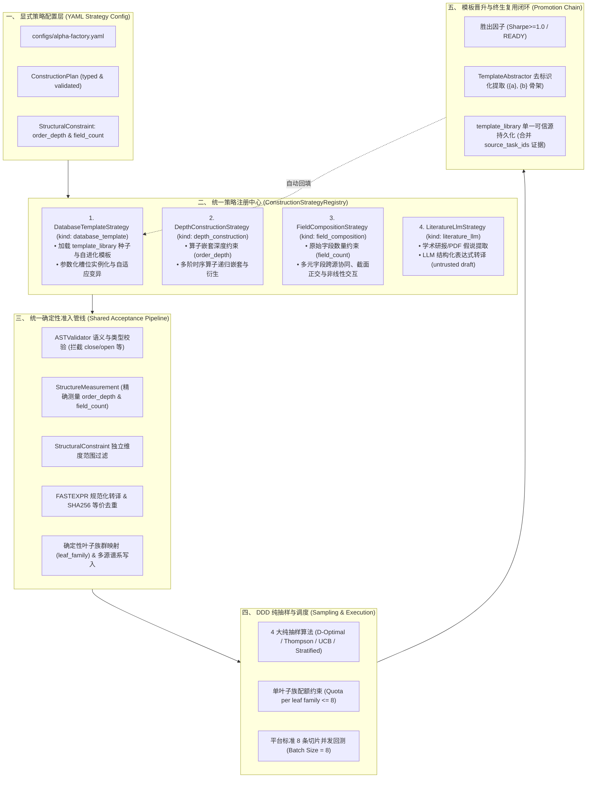

# 因子生成策略与多族架构设计 (Strategy Architecture)

> **定位**: 阐述 Alpha Factory 统一因子构造策略体系（Unified Construction Strategies）、10 大母版族群、AST 结构测量与约束、符号语法树自由杂交与 DDD 纯抽样探索架构。

---

## 一、 统一构造策略架构全景

框架的因子生成已全面演进为 **统一显式声明构造策略 + AST 独立结构约束 (`order_depth`, `field_count`) + 统一确定性准入管线 + 10 大母版族群 + 符号语法树自由杂交 + 模板库闭环晋升**：



---

## 二、 独立结构约束维度与测量 (`research/structure.py`)

系统引入两个正交且解耦的 AST 结构测量维度：
- **`order_depth`（算子嵌套深度）**：
  - 从 AST 根节点到叶子节点所经过的算子层级深度；
  - 一阶算子（如 `rank(A)`、`ts_delta(A, 20)`）对应 `order_depth = 1`；
  - 二阶复合算子（如 `group_rank(ts_delta(A, 20), subindustry)`）对应 `order_depth = 2`；
  - 高阶嵌套（如 `ts_scale(group_rank(ts_delta(A, 20), subindustry), 30)`）对应 `order_depth = 3`。
- **`field_count`（原始字段数量）**：
  - AST 树中引用的去重底层特征字段总数；
  - 单字段公式（`field_count = 1`）、双字段比率/残差（`field_count = 2`）、三字段条件切换（`field_count = 3`）。
- **独立过滤与声明**：
  ```yaml
  research:
    construction:
      strategies:
        - strategy_id: "deep_momentum"
          kind: "depth_construction"
          families: ["ts_momentum", "macd_velocity"]
          order_depth: { exact: 3 }
          field_count: { exact: 1 }
          quota_per_leaf_family: 8
  ```

---

## 三、 10 大生成族群核心机理

| 族群名称 | 标识符 (Family) | 核心数学形态示例 | 捕获的金融异象 / 机制 |
| :--- | :--- | :--- | :--- |
| **1. 时序动量族** | `ts_momentum` | `group_neutralize(rank(ts_delta(A, 20)), subindustry)` | 价格与预期基本面的中期趋势持续性 |
| **2. 均值反转族** | `mean_reversion` | `-1.0 * group_neutralize(rank(A), subindustry)` | 短期过度反应与流动性冲击后的均值回归 |
| **3. MACD加速度族**| `macd_velocity` | `group_neutralize(rank(ts_decay(A, 5) - ts_decay(A, 20)), subindustry)` | 短期预期均线相对于长期均线的加速度突破 |
| **4. 相对比率溢价族**| `relative_ratio` | `group_neutralize(rank(A) / (0.01 + rank(B)), subindustry)` | 跨特征估值溢价与相对质量比率 |
| **5. 不对称波动族** | `asymmetric_risk`| `group_neutralize(rank(ts_std_dev(A, 20) / (0.01 + ts_mean(A, 20))), subindustry)` | 波动率异象与下行风险补偿 |
| **6. 行业-特质正交分解**| `sector_decomposition` | `ts_zscore(A, 20) - ts_zscore(group_neutralize(A, sector), 20)` | 剥离行业 Beta 后的特质纯 Alpha 剪刀差 |
| **7. 三层尺度架构** | `three_tier_scaling` | `ts_scale(group_rank(A, subindustry), 30)` | 内层特征、中层行业分箱、外层滚动时序标准化 |
| **8. 跨源多数据协同**| `cross_interaction` | `group_neutralize(rank(A) * rank(B), subindustry)` | 另类情绪与基本面之间的多源非线性协同 |
| **9. 符号杂交进化** | `symbolic_evolution` | 递归 AST 1~4 层深度树生成 | 摆脱人工模板，自动生成高阶现代量化形态 |
| **10. 沉淀知识蒸馏**| `evolved_distillation` | 动态加载 `template_library` 骨架并注入新字段 | 站在历史成功因子的肩膀上跨数据集复用 |

---

## 四、 DDD 抽样探索算法

位于 `alpha_operator_framework/research/selection.py`：

1. **`D-Optimal`（推荐默认）**：
   - 构建候选因子的特征矩阵（操作符指纹、窗口跨度、分组维度）；
   - 最大化信息矩阵行列式 $\det(X^T X)$，确保在有限回测配额下覆盖最大化的假设特征空间。
2. **`Thompson Sampling`**：
   - 为每个模板族维护 Beta 分布后验胜率；
   - 每次回测时从后验分布抽样，自适应将更多配额倾斜给历史高夏普族群，同时保留探索能力。
3. **`UCB (Upper Confidence Bound)`**：
   - 平衡族群平均胜率与试验不确定性；
   - 优先尝试高潜力且试验次数较少的新兴结构族。
4. **`Stratified`**：
   - 严格分层均衡抽样，保证每个模板族均匀分配回测任务，适合全景摸底。
5. **`Diversity`**：
   - 基于 AST 树结构编辑距离最大化候选多样性，剔除同质化候选。

---

## 五、 统一构造策略 Python API 示例

```python
from alpha_operator_framework.research.strategy_config import (
    ConstructionPlan,
    ConstructionStrategyConfig,
    StructuralConstraint,
)
from alpha_operator_framework.research.strategies import ConstructionStrategyRegistry
from alpha_operator_framework.domain.fields import FieldSpec

# 1. 构造类型化配置方案
plan = ConstructionPlan(
    strategies=(
        ConstructionStrategyConfig(
            strategy_id="base_db_templates",
            kind="database_template",
            families=("unary", "binary"),
            order_depth=StructuralConstraint(minimum=1, maximum=2),
            field_count=StructuralConstraint(minimum=1, maximum=2),
            quota_per_leaf_family=8,
        ),
    ),
    platform_batch_size=8,
)

# 2. 注册与候选生成
registry = ConstructionStrategyRegistry()
fields = [
    FieldSpec(id="returns", dataset_id="pv1", type="MATRIX"),
    FieldSpec(id="volume", dataset_id="pv1", type="MATRIX"),
]
candidates = registry.generate_candidates(plan, fields=fields, seed=42)
print(f"✅ 统一构造管线生成并验收 {len(candidates)} 个规范候选")
```