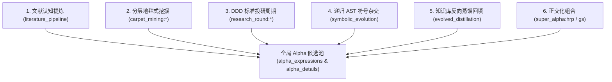

# Alpha 因子全来源与溯源分析指南 (Alpha Source Guide)

> **定位**: 阐述 Alpha Factory 中 Alpha 因子的全生命周期来源体系、数据流向与溯源查询。

---

## 一、 Alpha 因子的多元来源体系

本框架中的 Alpha 因子具有严格的谱系溯源标记（`expression_origin`），主要涵盖以下 6 大来源：



---

## 二、 6 大来源获取与生成方式

### 1. 学术研报文献提炼 (`literature_pipeline`)
- **机理**: 解析 PDF/Markdown 论文，通过大语言模型或因果规则提取假说，经 `FieldGrounder` 动态对齐真实平台可用字段。
- **标记**: `expression_origin = 'literature:<paper_name>'`。
- **CLI**: `python alpha_machine.py research --paper docs/academic_paper.pdf --execute`

### 2. 分层地毯式挖掘 (`carpet_mining`)
- **机理**: 对指定市场与另类数据集进行 10 大生成族群分层抽样回测。
- **标记**: `expression_origin = 'carpet_mining:<family_name>'`。
- **CLI**: `python alpha_machine.py mine --datasets analyst7 --sample-per-family 4 --execute`

### 3. DDD 10 阶段标准化投研周期 (`research_round`)
- **机理**: 基于 `ResearchRound` 聚合与 4 大纯抽样算法（D-Optimal, Thompson, UCB, Stratified）生成的探索批次。
- **标记**: `expression_origin = 'research_cycle:<round_id>'`。
- **CLI**: `python alpha_machine.py research-cycle --algorithm d_optimal --execute`

### 4. 递归 AST 符号自由杂交 (`symbolic_evolution`)
- **机理**: 由 `SymbolicTreeBreeder` 自动递归生成的三层尺度架构与行业-特质正交分解因子。
- **标记**: `expression_origin = 'symbolic_evolution'`。

### 5. 沉淀知识库母版实例化 (`evolved_distillation`)
- **机理**: 从 `template_library` 加载历史胜出公式去标识化提炼出的骨架模板，动态填入新数据集字段。
- **标记**: `expression_origin = 'evolved_distillation:<template_id>'`。

### 6. 超级因子组合 (`super_alpha`)
- **机理**: 对已有高夏普异构因子进行 Gram-Schmidt 正交化与 HRP 资产配置组合。
- **标记**: `expression_origin = 'super_alpha:hrp'`。
- **CLI**: `python alpha_machine.py simulate-super --candidates data/super_cand.json --execute`

---

## 三、 数据库查询与溯源 SQL

```sql
-- 1. 按来源统计各渠道产出的 Alpha 数量与平均夏普
SELECT e.expression_origin,
       COUNT(d.alpha_id) AS alpha_count,
       AVG(d.sharpe) AS avg_sharpe,
       MAX(d.sharpe) AS max_sharpe
FROM alpha_expressions e
LEFT JOIN alpha_details d ON e.expression_sha = d.expression_sha
GROUP BY e.expression_origin
ORDER BY avg_sharpe DESC;

-- 2. 查询通过 6 维证据终审 (SUBMISSION_READY) 的因子详情
SELECT d.alpha_id, e.expression_origin, d.expression, d.sharpe, d.fitness, d.turnover
FROM alpha_details d
JOIN alpha_expressions e ON d.expression_sha = e.expression_sha
WHERE d.wf_stage = 'submission_ready' OR d.grade = 'READY'
ORDER BY d.sharpe DESC;
```