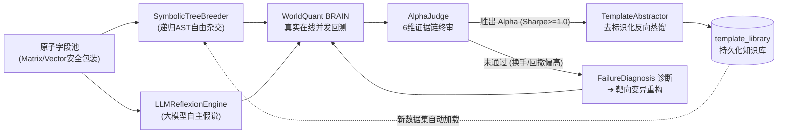

# 🧬 Alpha Factory 全自主进化与高阶因子挖掘实战指导手册
> **Autonomous Alpha Evolution, Symbolic Tree Breeding & Closed-Loop Reflexion Guide**

---

## 📖 目录

1. [设计理念：从“人工模板”到“全自主自进化”](#1-设计理念从人工模板到全自主自进化)
2. [四大自进化阶段详解 (Phase 1 ~ Phase 4)](#2-四大自进化阶段详解-phase-1--phase-4)
   - [Phase 1: 胜出因子自主反向蒸馏 (Auto-Distillation)](#phase-1-胜出因子自主反向蒸馏-auto-distillation)
   - [Phase 2: 跨数据集动态知识库回流 (Cross-Dataset Transfer)](#phase-2-跨数据集动态知识库回流-cross-dataset-transfer)
   - [Phase 3: 符号语法树自由杂交与进化 (Symbolic Tree Breeding)](#phase-3-符号语法树自由杂交与进化-symbolic-tree-breeding)
   - [Phase 4: 大模型自主假说与失败自反思闭环 (LLM Reflexion Engine)](#phase-4-大模型自主假说与失败自反思闭环-llm-reflexion-engine)
3. [10 大表达式生成族群速查矩阵](#3-10-大表达式生成族群速查矩阵)
4. [全自动无人值守投研脚本实战指南](#4-全自动无人值守投研脚本实战指南)
5. [数据库与模板知识库深度维护](#5-数据库与模板知识库深度维护)
6. [高频常见问题与故障排查 (FAQ)](#6-高频常见问题与故障排查-faq)

---

## 1. 设计理念：从“人工模板”到“全自主自进化”

在传统的量化因子挖掘中，研究人员通常面临两个核心痛点：
1. **人工模板死板且表达力受限**：手写几套固定模板（如 `ts_delta(x, 20)`）极易陷入局部最优，无法自主组合出高阶的三层架构与多源正交形态；
2. **经验无法跨任务迁移**：在数据集 A 上探索出高胜率的公式骨架后，换到数据集 B 往往需要人工重新编写适配代码。

**Alpha Factory 自主进化引擎**彻底打破了人工模板的桎梏，实现了：
$$\text{字段认知清洗} \longrightarrow \text{符号自由杂交} \longrightarrow \text{平台实测与终审} \longrightarrow \text{自动提炼骨架} \longrightarrow \text{跨数据集终身复用}$$



---

## 2. 四大自进化阶段详解 (Phase 1 ~ Phase 4)

### Phase 1: 胜出因子自主反向蒸馏 (Auto-Distillation)
- **触发时机**：当回测完成并经过 `AlphaJudge` 6 维终审时，只要出现满足 `Sharpe >= 1.0`、综合优先级得分 $\ge 60$ 或判定结论为 `READY` 的优胜因子；
- **抽象机理**：
  - 调用 `TemplateAbstractor` 扫描 AST 树，保留算子与分组参数（如 `subindustry`, `sector`, `cap_bucket`），将具体特征字段去标识化为通用槽位 `{a}`, `{b}`：
  $$\text{ts\_scale}(\text{group\_rank}(\mathbf{est\_fcf}, \text{subindustry}), 30) \quad \Longrightarrow \quad \text{ts\_scale}(\text{group\_rank}(\mathbf{\{a\}}, \text{subindustry}), 30)$$
- **自动落库**：通过 `TemplateRepository.save_abstracted_template` 自动赋予哈希指纹并幂等写入 `template_library` 表。

---

### Phase 2: 跨数据集动态知识库回流 (Cross-Dataset Transfer)
- **知识迁移机制**：
  - 当您在探索一个全新的数据集（如从分析师预期 `analyst7` 切换到财报基本面 `fundamental31` 或内部交易 `insider_agg_matrix`）时；
  - 挖掘引擎 `StratifiedCarpetMiner` 在启动时会自动查询数据库中所有已沉淀的活跃模板（`evolved_distillation` 族群）；
  - 自动将新数据集的字段填入历史胜出模板的 `{a}`, `{b}` 槽位中，实现**站在历史成功经验的肩膀上自动探索新数据**。

---

### Phase 3: 符号语法树自由杂交与进化 (Symbolic Tree Breeding)
- **核心模块**: `SymbolicTreeBreeder` (`alpha_operator_framework/domain/ast/breeder.py`)
- **摆脱人工模板**：无需预先定义死板公式，基于算子形式语法规则与递归产生式自由组合 1~4 层深度树；
- **两大现代量化高阶形态**：
  1. **三层尺度架构（Three-Tier Scaling）**：
     - *内层*：特征原子核（或时序差分动量）；
     - *中层*：细分行业截面百分位排名（`group_rank(..., subindustry)`）或市值分箱（`group_rank(..., bucket(rank(cap), ...))`）；
     - *外层*：滚动时序尺度标准化（`ts_scale(..., 30)` / `ts_zscore(..., 63)`），将不同时间截面的因子分布约束在稳定刻度上。
  2. **行业-特质正交分解（Sector-Idiosyncratic Decomposition）**：
     $$\text{Alpha} = \text{ts\_zscore}(A, w) - \text{ts\_zscore}(\text{group\_neutralize}(A, \text{sector}), w)$$
     - 捕捉个股原始时序动量与剥离行业 Beta 后的特质动量之间的“剪刀差”，具备极强的超额收益纯度。
- **100% 语法安全保证**：所有生成的表达式必须通过 `ASTValidator` 的静态语义检查，并经由 `to_canonical_string` 进行 AST 规范化去重。

---

### Phase 4: 大模型自主假说与失败自反思闭环 (LLM Reflexion Engine)
- **核心模块**: `LLMReflexionEngine` (`alpha_operator_framework/research/reflexion_engine.py`)
- **自主创造（无需人给公式）**：
  - 向大模型提供字段的物理与经济学含义、WorldQuant BRAIN 平台算子全景；
  - 由大模型自主推导具有深厚行为金融学机理的复杂数学表达式；
- **失败模式自反思（Self-Reflexion）**：
  - 将第一轮回测中未达标的因子病因（如换手率 85% 过高、最大回撤 35% 偏大、子宇宙夏普不达标）结构化反馈给大模型；
  - 大模型自主撰写反思总结（Reflexion Critique），并自针对性重构出二代改良公式（注入时序衰减平滑、施加反向符号、引入下行波动率惩罚）；
- **离线平滑降级**：未配置 API Key 或网络离线时，系统自动无缝切换为内置的高阶符号杂交规则，保证生产流水线永不中断。

---

## 3. 10 大表达式生成族群速查矩阵

系统在挖掘阶段并行调度 10 大族群，兼顾经典金融异象与全自主进化结构：

| 族群名称 | 标识符 (Family) | 核心数学形态示例 | 核心捕获的金融异象 / 机制 |
| :--- | :--- | :--- | :--- |
| **1. 时序动量族** | `ts_momentum` | `group_neutralize(rank(ts_delta(A, 20)), subindustry)` | 价格与预期基本面的中期趋势持续性 |
| **2. 均值反转族** | `mean_reversion` | `-1.0 * group_neutralize(rank(A), subindustry)` | 短期过度反应与流动性冲击后的均值回归 |
| **3. MACD加速度族**| `macd_velocity` | `group_neutralize(rank(ts_decay(A, 5) - ts_decay(A, 20)), subindustry)` | 短期预期均线相对于长期均线的加速度突破 |
| **4. 相对比率溢价族**| `relative_ratio` | `group_neutralize(rank(A) / (0.01 + rank(B)), subindustry)` | 跨特征估值溢价与相对质量比率 |
| **5. 风险不对称惩罚族**| `asymmetric_risk`| `group_neutralize(rank(ts_delta(A, 20)) / (0.01 + rank(ts_std_dev(A, 40))), subindustry)` | 下行波动率与高风险特征的惩罚性调整 |
| **6. 行业-特质正交分解**| `sector_decomposition`| `ts_zscore(A, 63) - ts_zscore(group_neutralize(A, sector), 63)` | 剥离宏观 Beta，捕捉纯个股特质 Alpha 剪刀差 |
| **7. 三层尺度架构族** | `three_tier_scaling` | `ts_scale(group_rank(A, subindustry), 30)` | 特征核 ➔ 行业百分位排名 ➔ 时序尺度极值归一 |
| **8. 跨数据集协同族** | `cross_interaction` | `group_neutralize(rank(ts_decay(A, 20)) * rank(B), subindustry)` | 多源另类数据（如分析师预期 × 财报质量）协同 |
| **9. 符号语法树自由进化**| `symbolic_evolution`| *由 SymbolicTreeBreeder 递归产生的合法高阶 AST* | **Phase 3**: 脱离人类预置模板，全自动探索 |
| **10. 数据库进化知识库** | `evolved_distillation`| *由 template_library 动态提取并实例化的模板* | **Phase 2**: 历史胜出因子抽象骨架动态复用 |

---

## 4. 全自动无人值守投研脚本实战指南

项目根目录提供了跨平台的一键运行脚本，默认自动开启增量未测空间抽样、动态模板加载与终审落库：

### 4.1 Linux / macOS / Git Bash (`run_autopilot.sh`)

```bash
# 语法:
# ./run_autopilot.sh [REGION] [UNIVERSE] [DATASETS] [DECAY] [SAMPLE_PER_FAMILY] [NEUTRALIZATION]

# 示例 1: 英国市场 (GBR / TOP700)，双数据集挖掘，每类抽样 5 条，Decay=12
./run_autopilot.sh GBR TOP700 "analyst7,fundamental31" 12 5 SUBINDUSTRY

# 示例 2: 美股市场 (USA / TOP3000)，多数据集全自主探索，每类抽样 8 条
./run_autopilot.sh USA TOP3000 "model250,risk71,insider_agg_matrix" 15 8 INDUSTRY
```

### 4.2 Windows PowerShell (`run_autopilot.ps1`)

```powershell
# 示例 1: 标准运行 (带颜色高亮与日志流式存储)
.\run_autopilot.ps1 -Region GBR -Universe TOP700 -Datasets "analyst7,fundamental31" -SamplePerFamily 5 -Decay 12

# 示例 2: 零配额消耗快速预览 (Dry-Run 模式)
.\run_autopilot.ps1 -Region GBR -Universe TOP700 -Datasets "analyst7" -DryRun
```

### 4.3 Python CLI 原生指令

```powershell
# 1. 执行全自动地毯式挖掘
python alpha_machine.py auto-pilot `
  --region GBR `
  --universe TOP700 `
  --datasets "analyst7,fundamental31" `
  --sample-per-family 5 `
  --batch-size 5 `
  --decay 12 `
  --neutralization SUBINDUSTRY `
  --min-sharpe 1.25 `
  --execute

# 2. 仅执行符号杂交与自进化挖掘并输出 Markdown 研报
python alpha_machine.py mine `
  --region GBR `
  --universe TOP700 `
  --datasets "analyst7,fundamental31" `
  --sample-per-family 5 `
  --decay 12 `
  --neutralization SUBINDUSTRY `
  --execute `
  --output runs/reports/gbr_carpet_mining.md
```

---

## 5. 数据库与模板知识库深度维护

系统所有元数据与因子绩效统一存放在 SQLite 本地库中（默认路径 `data/alpha_research.db`）。

### 5.1 常用 SQL 查询

```sql
-- 1. 查看数据库中当前沉淀的所有自进化模板与支撑度
SELECT id, name, family, title, slot_count, expression_template, created_at 
FROM template_library 
WHERE active = 1 
ORDER BY id DESC;

-- 2. 查询已回测达标并进入 SUBMISSION_READY 的优胜 Alpha
SELECT alpha_id, expression, sharpe, fitness, turnover, margin, wf_stage 
FROM alpha_details 
WHERE sharpe >= 1.25 AND wf_stage = 'submission_ready'
ORDER BY sharpe DESC;

-- 3. 查看自动生成的淘汰剪枝规则
SELECT id, pattern, pattern_type, reason, created_at 
FROM template_prune_rules 
WHERE active = 1;
```

### 5.2 数据库一键运维

```powershell
# 校验数据库结构完整性与版本
python init_db.py --verify

# 释放历史回测冗余数据并执行物理空间释放 (VACUUM)
python alpha_machine.py clean-db --mode stale
```

---

## 6. 高频常见问题与故障排查 (FAQ)

### Q1: 连续运行两次挖掘，为什么抽取出的候选表达式不一样？
> **答**：这是系统设计的核心特性（「数据库感知 · 未测空间优先」增量抽样机制）。系统在抽样前会自动读取 `alpha_expressions` 表中已回测的 SHA-256 指纹，并在抽取时自动跳过已测过的空间，优先探索全新表达式，最大化利用平台回测额度。

### Q2: 遇到 `VECTOR` 或 `EVENT` 类型的复杂数据集会报错吗？
> **答**：不会。系统在阶段一自动应用了数据安全护栏，所有 `VECTOR` 或 `EVENT` 字段在进入 AST 产生式前，都会被自动封装为 `winsorize(ts_backfill(vec_avg(fid), 120), std=4.0)`，保证 100% 符合 WorldQuant BRAIN 平台的标量输入要求。

### Q3: 如何查看胜出因子反向蒸馏沉淀的具体模板？
> **答**：每次挖掘完成后，系统生成的 Markdown 总结研报尾部会展示 **「三、 🧬 本轮自主反向蒸馏沉淀的新模板骨架」** 板块，列出所有新存入 `template_library` 表的抽象结构。
