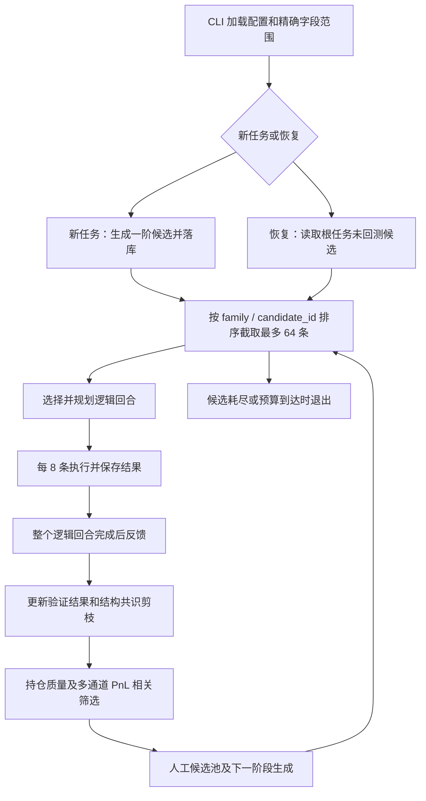

# 研究循环流程评估

评估日期：2026-09-07；代码版本：`5c88013`。范围是当前 Alpha Factory 的生产 CLI、研究协调器、执行器、数据库投影及默认配置；本次仅评估，没有修改运行逻辑、启动平台回测或提交 Alpha。

## 结论

整体框架合理，但目前不能认定为可靠的持续研究闭环。分阶段构造、显式晋升门、物理分片持久化、谱系记录和独立提交授权值得保留；预算恢复、调度公平性、验证状态及重试终止存在具体缺口。优先修复闭环语义，再讨论扩大回测规模。

只读打开 `data/alpha_research.db` 并查询 sqlite_master 时返回 `sqlite3.DatabaseError: database disk image is malformed`。当前配置指向该路径，但尚未核实运行进程是否覆盖了配置。这是本地读库失败的证据，尚不能据此判断损坏范围或原因；本次没有执行修复。因此下文是代码及配置评估，不是实盘研究收益或当前运行健康证明。

## 当前流程

默认配置为 GBR/TOP700、delay=1、decay=8、SUBINDUSTRY、truncation=0.08；默认构造链为 raw-first-order → qualified-depth → qualified-group-second-order → signal-validation。其他模式包含数据库模板、AI 种子、多字段组合。具体运行参数可以覆盖默认值。

默认晋升门 Sharpe>0.6、Fitness>0.4 是探索门；人工信号队列另用 Sharpe>1.25、Fitness>0.8。两者不是提交合格线。预算配置为 1024，逻辑窗口为 64，物理批次为 8。

## 优先问题与验收标准

| 优先级 | 发现与影响 | 建议及验收标准 |
|---|---|---|
| P1 | **任务预算实际上按进程调用计数。** `run()` 每次把 completed_backtests 置零；恢复只读取待测候选，不扣除历史已消耗预算。恢复同一任务可以再次获得 1024 配额。 | 按根任务持久化累计预算，并明确失败尝试是否计费；中断恢复后累计不得超过任务上限，部分完成也应计账。 |
| P1 | **验证终态会被入池覆盖。** 循环先执行 `_evaluate_signal_validations`，随后 `_queue_signal_candidates` 对符合信号门的历史幸存父节点再次写入 rank_sign_pending；候选表 upsert 无条件覆盖 robustness_status，也覆盖默认为空的相关指标。 | 将候选发现与证据更新分开，或使重复入池保留已有证据；验收 pass/fail 和 PC/SC 在后续循环后仍保留。 |
| P1 | **部分重试分支没有次数上限。** 网络异常分支检查 max_retry_attempts，但返回 error 的可重试结果分支以及结果缺失分支持续安排重试，协调器持续等待。 | 统一逐任务重试计数和终止条件；连续错误、空结果、部分结果均能在上限后明确退出或隔离。平台容量等待可独立建模为暂停状态。 |
| P1 | **恢复未冻结原研究方案。** CLI 在判断 continue 前加载当前 YAML 构造方案、字段和设置；恢复分支只检查任务存在，没有恢复或比较持久化方案。 | 保存并恢复配置与字段清单指纹；原任务恢复必须一致，变更方案应形成明确的新研究版本。 |
| P1 | **窗口存在结构性偏置。** 先按 family 排序取 64，再进入选择器；前部家族可独占可见窗口。新生成的 depth 等家族还可能排到 raw 家族前面，挤占初始探索。 | 用家族轮转或分层配额构造窗口，给终端验证预留容量；验收有限预算下每个计划家族能获得最低探索量，验证不会被派生候选长期挤压。 |
| P2 | **反馈频率与物理批次不同。** 每 8 条已经落库，但协调器等最多 64 条完成才结构剪枝、晋升和安排验证；逻辑回合失败还会直接返回，已成功结果没有当轮完成反馈。 | 明确选择窗口、执行批次和反馈周期三个参数；可保留 64 条候选可见范围，每完成 8 条反馈一次，且失败不丢成功样本的反馈机会。 |
| P2 | **跨任务作用域不够明确。** 已完成结果读取和结构剪枝只按 settings，未限制根任务、数据集或研究版本；同设置的历史结果可影响本任务晋升及其他目录候选剪枝。 | 历史知识复用可以保留，但应显式选择证据范围；任务局部状态与共享结构知识分离，验收任务 A 的局部操作不会意外退役 B 的候选。 |
| P2 | **early_stop_signal_count 并不停止研究。** 它按低晋升门筛出的 promotable 数量触发，达到 8 个后转送验证，而非按最终合格信号停止；主循环仍继续消耗候选。 | 若意图是跳过升阶，重命名为直送验证阈值；若意图是找到足够信号就停，应按完成验证的独立信号计数并停止新探索。 |
| P2 | **检查语义被压缩。** 数据库加载的 checks_passed 只由 RA/PPA 失败数推导，NULL 又默认作零；它不能证明所有平台检查 PASS。PnL 缺失允许保留探索分支，但协调器没有把缺失标记保留到 CompletedExpression。 | 将探索资格、证据待补、完整验证通过分开；缺失检查必须为 pending，不应以一个布尔值代表全部平台检查。此发现不等于已经发生未经授权提交。 |

代码定位：

- [预算、窗口和反馈顺序](D:/quant/alpha_factory/alpha_operator_framework/application/research_loop.py:116)
- [恢复入口](D:/quant/alpha_factory/alpha_operator_framework/cli/research.py:128)
- [可重试错误返回分支](D:/quant/alpha_factory/alpha_operator_framework/application/research_worker.py:472)
- [提前转验证语义](D:/quant/alpha_factory/alpha_operator_framework/application/research_loop.py:567)
- [重复入池](D:/quant/alpha_factory/alpha_operator_framework/application/research_loop.py:628) 与 [覆盖更新](D:/quant/alpha_factory/alpha_operator_framework/database/repositories/queue.py:163)
- [历史结果与检查投影](D:/quant/alpha_factory/alpha_operator_framework/database/repositories/alpha_query.py:324) 与 [共享剪枝范围](D:/quant/alpha_factory/alpha_operator_framework/database/repositories/alpha_write.py:336)

## 研究方法层面的评价

低阈值探索后再严格验证是合理的，不应直接把提交门前移，否则会过早扼杀可优化信号。多指标排序通道后取幸存者并集，也比单选 Sharpe 冠军更适合保留差异化方向；但并集不保证最终任意两条都低相关，应与最终组合去重区分。

结构共识剪枝已有至少 4 个样本、至少 3 个不同字段且无晋升门通过样本的保护，优于单次失败就退役模板；但这仍是启发式，不足以证明模板在所有字段或数据集都无效。建议先降权并保留少量复核预算，再决定长期退役。

当前逻辑主要使用同一回测指标反复选择父节点，rank/sign 测试检验的是变换敏感性，不能替代跨时间、子样本或样本外证据。后续应把冻结候选后的独立验证单列为阶段；本次未运行平台验证，也不判断现有策略是否存在实际可交易优势。

## 建议的最小调整顺序

1. 核实运行库路径与可读性，在副本上诊断数据库问题；验收能一致读取任务、候选及结果，不对原库盲目修复。
2. 修复预算恢复、方案一致性、重试终止和验证状态覆盖；验收覆盖中断恢复、局部失败、重复入池三类场景。
3. 调整窗口为分层轮转并给验证留容量；验收每个家族的覆盖量和验证等待时间可量化。
4. 明确反馈频率、共享知识边界和停止目标；验收停止原因与计数可从持久化记录重建。
5. 再进行有限预算对照实验：固定字段、设置、总预算，对比当前调度与轮转调度的家族覆盖、有效晋升率、独立验证通过数、重复率及每个有效信号的回测成本。不能只比较最高 Sharpe。

## 本次验证边界

运行 `python -m pytest tests/application/test_research_loop.py tests/application/test_research_worker.py tests/cli/test_research_cli.py -q`：31 passed，1 个 pytest 缓存目录写入权限警告。现有测试通过不否定上述未覆盖的跨回合和恢复路径问题；本次未新写回归测试或修复代码。

初始 git status 为空。本报告是本次新增交付文件。没有运行完整测试套件、平台模拟、相关性检查或样本外测试；数据库查询失败，因此没有可确认的当前任务漏斗统计。
